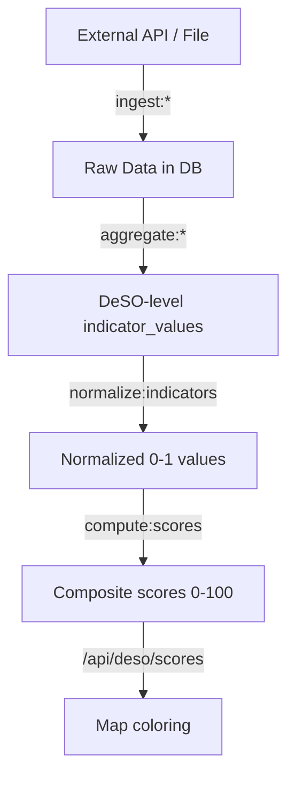

# TASK: Living Documentation Site + Autonomous Documentation Agent

## Context

The platform has grown to the point where institutional knowledge lives scattered across task files, CLAUDE.md, code comments, and conversation history. No developer (human or AI) can onboard without reading 10+ markdown files. We need a proper documentation site that:

1. Serves as the single source of truth for the entire system
2. Is searchable (full-text, instant)
3. Is parseable by other AI agents (`llms.txt` format)
4. Lives on a docs subdomain (docs.bostad.app or similar)
5. Is **continuously maintained by a dedicated Claude Code agent** running on a separate branch

---

## Part 1: Documentation Site Setup

### 1.1 Technology: VitePress

**VitePress** is the right choice:
- Markdown → static HTML (our docs are already markdown-heavy)
- Built-in **MiniSearch** — client-side full-text search, zero infrastructure
- Generates `llms.txt` / `llms-full.txt` — the entire docs as a single text file, purpose-built for LLM consumption
- Vue-based but we don't need to write Vue — it's just markdown with config
- Builds in <5 seconds, deploys as static files anywhere
- Used by Vue, Vite, Vitest, Pinia — battle-tested at scale

No Meilisearch, no Algolia, no backend needed. MiniSearch runs entirely in the browser and handles hundreds of pages effortlessly.

### 1.2 Directory Structure

The docs live **inside the main repo** in a `/docs` directory:

```
docs/
├── .vitepress/
│   ├── config.ts              # VitePress configuration
│   └── theme/
│       └── style.css          # Custom styles (minimal)
├── public/
│   └── logo.svg               # Site logo
├── index.md                   # Landing page
│
├── architecture/
│   ├── index.md               # Architecture overview
│   ├── stack.md               # Technology stack decisions
│   ├── database-schema.md     # Full schema documentation
│   ├── spatial-framework.md   # DeSO + H3 explanation
│   ├── indicator-pattern.md   # The core indicator abstraction
│   └── scoring-engine.md      # Composite score computation
│
├── data-sources/
│   ├── index.md               # Data sources overview + status matrix
│   ├── scb-demographics.md    # SCB: what we fetch, how, gotchas
│   ├── skolverket-schools.md  # Skolverket: both APIs, field mappings
│   ├── bra-crime.md           # BRÅ: available data, disaggregation plan
│   ├── kronofogden-debt.md    # Kronofogden: regression approach
│   ├── gtfs-transit.md        # Trafiklab GTFS: feeds, processing
│   ├── poi-openstreetmap.md   # OSM Overpass queries, POI categories
│   └── poi-google-places.md   # Google Places: what we use it for
│
├── data-pipeline/
│   ├── index.md               # Pipeline overview: ingest → normalize → score
│   ├── ingestion.md           # Artisan commands, scheduling, error handling
│   ├── normalization.md       # Percentile rank, min-max, z-score
│   ├── scoring.md             # Weighted composite, direction, factor identification
│   ├── aggregation.md         # School → DeSO, POI → DeSO, transit → DeSO
│   └── data-quality.md        # Known gaps, suppressed data, edge cases
│
├── indicators/
│   ├── index.md               # Master indicator table (all slugs, weights, sources)
│   ├── income.md              # median_income, low_economic_standard_pct
│   ├── employment.md          # employment_rate
│   ├── education.md           # education_post_secondary_pct, below_secondary
│   ├── school-quality.md      # merit_value_avg, goal_achievement, teacher_cert
│   ├── crime.md               # (planned) violent, property, perceived safety
│   ├── financial-distress.md  # (planned) debt_rate, evictions
│   ├── transit.md             # (planned) frequency, proximity, commute
│   └── poi.md                 # (planned) negative/positive POI density
│
├── methodology/
│   ├── index.md               # Methodology overview
│   ├── scoring-model.md       # How the 0-100 score works, weight budget
│   ├── normalization.md       # Why percentile rank, direction inversion
│   ├── meritvalue.md          # Swedish meritvärde system explained
│   ├── deso-explained.md      # What DeSOs are, why they matter
│   ├── disaggregation.md      # How we handle kommun→DeSO (Kronofogden)
│   ├── urbanity.md            # Urban/rural classification, weight scaling
│   └── legal-constraints.md   # GDPR, Supreme Court ruling, what we can't do
│
├── frontend/
│   ├── index.md               # Frontend architecture overview
│   ├── map-rendering.md       # OpenLayers, DeSO polygons, H3 hexagons
│   ├── sidebar.md             # Sidebar structure, sections, data flow
│   ├── school-markers.md      # School layer, clustering, interaction
│   ├── poi-display.md         # POI icons, zoom tiers, controls
│   ├── admin-dashboard.md     # Indicator management, weight tuning
│   └── components.md          # Key React components reference
│
├── api/
│   ├── index.md               # API endpoints overview
│   ├── deso-geojson.md        # GET /api/deso/geojson
│   ├── deso-scores.md         # GET /api/deso/scores
│   ├── deso-schools.md        # GET /api/deso/{code}/schools
│   ├── pois.md                # GET /api/pois
│   └── admin-endpoints.md     # PUT /admin/indicators, POST /admin/recompute
│
├── operations/
│   ├── index.md               # Operations overview
│   ├── docker-setup.md        # Docker Compose, services, volumes
│   ├── running-locally.md     # How to get the app running
│   ├── artisan-commands.md    # All custom Artisan commands reference
│   ├── data-refresh.md        # Schedule, manual triggers, monitoring
│   └── troubleshooting.md     # Common issues + fixes
│
├── business/
│   ├── index.md               # Business context overview
│   ├── target-customers.md    # Who buys this, pricing tiers
│   ├── competitor-landscape.md # NeighborhoodScout, Booli, Hemnet
│   ├── tiering-model.md       # Free → single unlock → subscription → API
│   └── go-to-market.md        # Launch strategy, channels
│
└── changelog/
    ├── index.md               # Changelog overview
    └── 2026-02.md             # February 2026 changes
```

### 1.3 VitePress Config

```typescript
// docs/.vitepress/config.ts
import { defineConfig } from 'vitepress'

export default defineConfig({
  title: 'Bostad Platform',
  description: 'Swedish Real Estate Prediction Platform — Internal Documentation',
  
  head: [
    ['link', { rel: 'icon', href: '/logo.svg' }],
  ],
  
  themeConfig: {
    logo: '/logo.svg',
    
    search: {
      provider: 'local',   // MiniSearch — zero config, works instantly
    },
    
    nav: [
      { text: 'Architecture', link: '/architecture/' },
      { text: 'Data Sources', link: '/data-sources/' },
      { text: 'Pipeline', link: '/data-pipeline/' },
      { text: 'Methodology', link: '/methodology/' },
      { text: 'API', link: '/api/' },
      { text: 'Operations', link: '/operations/' },
    ],
    
    sidebar: {
      '/architecture/': [
        {
          text: 'Architecture',
          items: [
            { text: 'Overview', link: '/architecture/' },
            { text: 'Tech Stack', link: '/architecture/stack' },
            { text: 'Database Schema', link: '/architecture/database-schema' },
            { text: 'Spatial Framework', link: '/architecture/spatial-framework' },
            { text: 'Indicator Pattern', link: '/architecture/indicator-pattern' },
            { text: 'Scoring Engine', link: '/architecture/scoring-engine' },
          ],
        },
      ],
      '/data-sources/': [
        {
          text: 'Data Sources',
          items: [
            { text: 'Overview', link: '/data-sources/' },
            { text: 'SCB Demographics', link: '/data-sources/scb-demographics' },
            { text: 'Skolverket Schools', link: '/data-sources/skolverket-schools' },
            { text: 'BRÅ Crime', link: '/data-sources/bra-crime' },
            { text: 'Kronofogden Debt', link: '/data-sources/kronofogden-debt' },
            { text: 'GTFS Transit', link: '/data-sources/gtfs-transit' },
            { text: 'POI (OpenStreetMap)', link: '/data-sources/poi-openstreetmap' },
            { text: 'POI (Google Places)', link: '/data-sources/poi-google-places' },
          ],
        },
      ],
      // ... etc for each section
    },
    
    socialLinks: [
      { icon: 'github', link: 'https://github.com/your-org/bostad-platform' },
    ],
    
    footer: {
      message: 'Internal documentation — not for public distribution',
    },
    
    editLink: {
      pattern: 'https://github.com/your-org/bostad-platform/edit/docs/docs/:path',
      text: 'Edit this page',
    },
  },
  
  // Generate llms.txt for agent consumption
  transformHead({ assets }) {
    // VitePress generates /llms.txt automatically if configured
  },
  
  markdown: {
    lineNumbers: true,    // Show line numbers in code blocks
  },
})
```

### 1.4 LLM-Parseable Output

VitePress can generate `/llms.txt` and `/llms-full.txt` — flat text files containing all documentation, designed for LLM context windows. Enable with the `vitepress-knowledge` plugin or generate manually at build time:

```bash
# Post-build: concatenate all markdown into one file
find docs -name "*.md" -not -path "*/node_modules/*" | sort | while read f; do
    echo "---"
    echo "# Source: $f"
    echo "---"
    cat "$f"
    echo ""
done > docs/.vitepress/dist/llms-full.txt
```

This file becomes the ultimate context document for any agent working on the project. Instead of reading 30 files, an agent reads one.

### 1.5 Docker Service for Docs

Add to the existing Docker Compose:

```yaml
services:
  docs:
    image: node:20-alpine
    working_dir: /app/docs
    command: sh -c "npm install && npx vitepress dev --host 0.0.0.0 --port 5173"
    volumes:
      - ./docs:/app/docs
    ports:
      - "5173:5173"
    profiles:
      - docs   # Only starts when explicitly requested: docker compose --profile docs up
```

For production, build static files and serve from nginx or any CDN:

```bash
cd docs && npx vitepress build
# Output in docs/.vitepress/dist/ — deploy to docs.bostad.app
```

---

## Part 2: Documentation Content Structure

### 2.1 What Each Page Must Cover

Every documentation page follows a consistent structure:

```markdown
# Page Title

> One-sentence summary of what this page covers.

## Overview

2-3 paragraphs explaining the concept at a high level.
What is it? Why does it exist? How does it fit into the bigger picture?

## How It Works

Technical details. Include:
- Architecture diagrams (Mermaid)
- Code examples (with file paths)
- Database queries
- API request/response examples

## Configuration

What can be changed? Where are the config files?
Environment variables, database settings, admin toggles.

## Data Flow

How does data move through this part of the system?
Use Mermaid flowcharts.

## Known Issues & Edge Cases

What breaks? What's suppressed? What's approximated?
This section is GOLD for future agents.

## Related Pages

Links to related documentation.
```

### 2.2 Critical Pages to Write First

These are the highest-value pages — the ones that save the most time for the next developer/agent:

1. **Data Sources Overview** (`data-sources/index.md`) — The status matrix:

```markdown
| Source | Status | Granularity | Update Freq | Indicators | API/File |
|---|---|---|---|---|---|
| SCB Demographics | ✅ Live | DeSO | Annual | 8 | API (PX-Web) |
| Skolverket Schools | ✅ Live | Point → DeSO | Daily/Annual | 3 | API (v2 + v3) |
| BRÅ Crime | 🟡 Planned | Police district | Quarterly | 4+ | Excel |
| Kronofogden Debt | 🟡 Planned | Kommun → DeSO | Annual | 4+ | Excel |
| GTFS Transit | 🟡 Planned | Stop → DeSO | Monthly | 3 | GTFS file |
| OSM POI | ✅ Live | Point → DeSO | Monthly | 2 | Overpass API |
| Google Places POI | 🟡 Planned | Point → DeSO | Monthly | 2 | Places API |
```

2. **Indicator Master Reference** (`indicators/index.md`) — Every indicator in one table:

```markdown
| Slug | Name | Source | Direction | Weight | Unit | Category | Status |
|---|---|---|---|---|---|---|---|
| `median_income` | Median Disposable Income | SCB | positive | 0.20 | SEK | income | ✅ |
| `school_merit_value_avg` | Average Merit Value | Skolverket | positive | 0.12 | points | education | ✅ |
| ... | | | | | | | |
```

3. **Pipeline Flow** (`data-pipeline/index.md`) — The complete journey:



4. **Artisan Commands Reference** (`operations/artisan-commands.md`) — Every command:

```markdown
## Data Ingestion

| Command | What It Does | Schedule | Duration |
|---|---|---|---|
| `ingest:scb --all` | Fetches all SCB indicators via PX-Web API | Annual (Feb) | ~5 min |
| `ingest:skolverket-schools` | Fetches school registry from Skolverket v2 | Monthly | ~3 min |
| `ingest:skolverket-stats` | Fetches school statistics from v3 API | Monthly | ~15 min |
| `ingest:gtfs` | Downloads GTFS Sverige 2 from Trafiklab | Monthly | ~2 min |
| ... | | | |

## Processing

| Command | What It Does | When To Run |
|---|---|---|
| `normalize:indicators --year=2024` | Compute percentile ranks | After any ingestion |
| `compute:scores --year=2024` | Weighted composite scores | After normalization |
| `aggregate:school-indicators` | Schools → DeSO averages | After school ingestion |
| ... | | |
```

---

## Part 3: The Documentation Agent

### 3.1 Concept

A Claude Code agent runs on a dedicated `docs` branch. Its sole job is to read the codebase and produce/update documentation. It doesn't write application code. It reads, understands, and documents.

### 3.2 Branch Setup

```bash
# Create the docs branch from main
git checkout main
git pull
git checkout -b docs

# Initialize VitePress
cd docs  # or create the docs/ directory
npm init -y
npm install -D vitepress

# Create initial structure
mkdir -p .vitepress architecture data-sources data-pipeline indicators methodology frontend api operations business changelog

# Scaffold config
# (create .vitepress/config.ts as shown above)

git add .
git commit -m "docs: initialize VitePress documentation site"
git push -u origin docs
```

### 3.3 Claude Code Agent Instructions

Create this file at the repo root (or pass as instructions when launching the agent):

#### File: `DOCS_AGENT.md`

```markdown
# Documentation Agent Instructions

You are a documentation agent. Your job is to create and maintain comprehensive
developer documentation for this codebase in the `/docs` directory using VitePress.

## Your Role

- You READ application code, migrations, services, commands, configs, and task files
- You WRITE documentation in `/docs/**/*.md`
- You DO NOT modify application code (anything outside `/docs`)
- You DO NOT run the application, tests, or artisan commands
- You commit your work frequently with descriptive messages

## Your Workflow

1. **Sync first:** Pull latest changes from `main` into your `docs` branch:
   ```bash
   git fetch origin main
   git merge origin/main --no-edit
   ```
   
2. **Scan for changes:** Check what's changed since your last run:
   ```bash
   git log docs..origin/main --oneline --name-only
   ```
   This tells you which files changed on main since your last merge.

3. **Read the codebase:** For each significant change, read the relevant files:
   - New migration? Update `architecture/database-schema.md`
   - New artisan command? Update `operations/artisan-commands.md`
   - New indicator? Update `indicators/index.md` and create per-indicator page
   - New API endpoint? Update `api/` section
   - New service class? Update architecture docs

4. **Write documentation** following the page template (see below).

5. **Update the sidebar** in `.vitepress/config.ts` if you add new pages.

6. **Commit and push:**
   ```bash
   git add docs/
   git commit -m "docs: update [section] — [what changed]"
   git push origin docs
   ```

## What to Document

### Priority 1: Data pipeline (the core IP)
- Every data source: what we fetch, API details, field mappings, gotchas
- Every indicator: slug, source, weight, direction, what it measures, known issues
- The scoring model: how weights combine, direction logic, factor identification
- Normalization: why percentile rank, how it works, edge cases

### Priority 2: Architecture decisions
- Why DeSO (not kommun, not H3-only)
- Why OpenLayers (not Mapbox, not Leaflet)
- Why Inertia.js (not SPA + API)
- Why PostgreSQL + PostGIS
- The indicator abstraction pattern

### Priority 3: Operations
- Every Artisan command with usage, flags, duration, error handling
- Docker setup: services, volumes, ports
- Data refresh schedule
- Troubleshooting common issues

### Priority 4: Frontend
- Map rendering pipeline (GeoJSON → OpenLayers → styled features)
- Sidebar data flow (click → API → render)
- Component hierarchy

### Priority 5: Business context
- Target customers, pricing, competitive landscape
- Legal constraints (GDPR, Supreme Court ruling)
- What we show at each tier (free vs paid)

## Page Template

Every page should follow this structure:

    # [Title]

    > [One-sentence summary]

    ## Overview

    [2-3 paragraphs of high-level explanation]

    ## How It Works

    [Technical details, code references, queries]

    ## Configuration

    [What's configurable, where, how]

    ## Data Flow

    [Mermaid diagram if applicable]

    ## Known Issues & Edge Cases

    [Critical for future agents — document EVERYTHING weird]

    ## Related

    - [Link to related page]
    - [Link to related page]

## How to Read the Codebase

Start from these entry points:

- `app/Console/Commands/` — All data pipeline commands
- `app/Services/` — Business logic (scoring, normalization, API clients)
- `app/Models/` — Eloquent models show the data structure
- `database/migrations/` — Schema evolution
- `routes/web.php` — All routes
- `resources/js/Pages/` — Frontend pages
- `resources/js/Components/` — Frontend components
- `CLAUDE.md` — Project overview
- `task.md` + `task-*.md` — Task specifications
- `project-context.md` — Full project context
- `data_pipeline_specification.md` — Data architecture spec

## Code Reference Style

When referencing code, include the file path:

    The scoring service (`app/Services/ScoringService.php`) computes 
    composite scores using a weighted sum of normalized indicator values.

    ```php
    // app/Services/ScoringService.php:42
    $directedValue = match($indicator->direction) {
        'positive' => $normalizedValue,
        'negative' => 1.0 - $normalizedValue,
        'neutral' => null,
    };
    ```

## Mermaid Diagrams

Use Mermaid for architecture and flow diagrams. VitePress renders them natively.

    ```mermaid
    graph LR
        A[SCB API] --> B[ingest:scb]
        B --> C[indicator_values]
        C --> D[normalize:indicators]
        D --> E[composite_scores]
    ```

## What NOT to Do

- Don't modify any file outside `/docs`
- Don't run artisan commands or docker commands
- Don't make up information — if you can't find it in the code, say "TODO: verify"
- Don't copy-paste entire files — summarize, explain, reference
- Don't write marketing copy — this is internal developer documentation
- Don't skip the "Known Issues" section — it's the most valuable part
```

### 3.4 How to Launch the Agent

```bash
# Terminal 1: Start the documentation agent
cd /path/to/bostad-platform
git checkout docs

# Launch Claude Code with the documentation agent instructions
claude-code --instructions DOCS_AGENT.md \
  --allowed-paths "docs/,app/,database/,routes/,resources/,config/,*.md" \
  --read-only "app/,database/,routes/,resources/,config/" \
  --writable "docs/"
```

If Claude Code doesn't support `--read-only` flags directly, use this prompt when starting the session:

```
You are the documentation agent for the bostad-platform project. 
Read DOCS_AGENT.md for your full instructions. 

Your job: read the entire codebase and produce comprehensive VitePress 
documentation in the /docs directory.

Rules:
- ONLY create/edit files in /docs/
- NEVER modify application code
- Start by merging latest main into this docs branch
- Then systematically document every part of the system
- Commit frequently

Start now. Begin by reading the codebase entry points listed in DOCS_AGENT.md,
then create documentation pages in priority order.
```

### 3.5 Running It Periodically

The docs agent should run:
- **After each major feature merge** to main (manually triggered)
- **Weekly** as a cron job to catch incremental changes
- **Before onboarding** a new developer or agent

```bash
# Cron-style: weekly docs update
# Add to CI or run manually
0 6 * * 1 cd /path/to/repo && git checkout docs && git merge origin/main --no-edit && claude-code --instructions DOCS_AGENT.md --auto
```

### 3.6 Merging Docs Back

The docs branch periodically gets merged to main so the docs directory is always up to date:

```bash
git checkout main
git merge docs --no-ff -m "docs: merge documentation updates"
git push origin main
```

Or use a PR workflow: docs branch → PR → review → merge to main.

---

## Part 4: Deployment

### 4.1 Local Development

```bash
cd docs
npx vitepress dev
# Opens at http://localhost:5173
```

### 4.2 Build

```bash
cd docs
npx vitepress build
# Static files in docs/.vitepress/dist/
```

### 4.3 Deploy Options

**Option A: Same server, nginx subdomain**

```nginx
server {
    listen 443 ssl;
    server_name docs.bostad.app;
    
    root /var/www/bostad-platform/docs/.vitepress/dist;
    index index.html;
    
    location / {
        try_files $uri $uri/ /index.html;
    }
}
```

**Option B: GitHub Pages** (free, easy)

```yaml
# .github/workflows/docs.yml
name: Deploy Docs
on:
  push:
    branches: [main, docs]
    paths: ['docs/**']

jobs:
  deploy:
    runs-on: ubuntu-latest
    steps:
      - uses: actions/checkout@v4
      - uses: actions/setup-node@v4
        with: { node-version: 20 }
      - run: cd docs && npm install && npx vitepress build
      - uses: peaceiris/actions-gh-pages@v3
        with:
          github_token: ${{ secrets.GITHUB_TOKEN }}
          publish_dir: docs/.vitepress/dist
```

**Option C: Vercel/Netlify** (free tier, auto-deploys)

Connect repo, set build command to `cd docs && npx vitepress build`, output dir to `docs/.vitepress/dist`.

### 4.4 Access Control

Since this is internal documentation:
- **Option A:** Basic auth via nginx (`htpasswd`)
- **Option B:** Cloudflare Access (free for <50 users, SSO)
- **Option C:** Just don't link it publicly — security by obscurity for now
- **Option D:** Deploy only on internal network / VPN

For now, Option C is fine. The docs contain no secrets (all data sources are public). The methodology is our IP but not dangerous to expose.

---

## Part 5: The llms.txt Standard

### 5.1 What Is llms.txt?

A convention for websites to provide LLM-friendly documentation. The file at `/llms.txt` contains a structured summary, and `/llms-full.txt` contains the complete documentation in a single text file.

### 5.2 Generate at Build Time

Add a post-build script:

```bash
#!/bin/bash
# scripts/generate-llms-txt.sh

DOCS_DIR="docs"
OUTPUT_DIR="docs/.vitepress/dist"

# llms.txt — structured summary
cat > "$OUTPUT_DIR/llms.txt" << 'EOF'
# Bostad Platform Documentation

> Swedish real estate prediction platform scoring neighborhoods using public government data.

## Sections

- [Architecture](/architecture/): Tech stack, database schema, spatial framework, scoring engine
- [Data Sources](/data-sources/): SCB, Skolverket, BRÅ, Kronofogden, GTFS, POI
- [Data Pipeline](/data-pipeline/): Ingestion, normalization, scoring, aggregation
- [Indicators](/indicators/): All indicators with weights, sources, methodology
- [Methodology](/methodology/): Scoring model, normalization, legal constraints
- [API](/api/): Internal API endpoints
- [Operations](/operations/): Docker, Artisan commands, troubleshooting
EOF

# llms-full.txt — everything in one file
echo "# Bostad Platform — Complete Documentation" > "$OUTPUT_DIR/llms-full.txt"
echo "" >> "$OUTPUT_DIR/llms-full.txt"
echo "Generated: $(date -u +%Y-%m-%dT%H:%M:%SZ)" >> "$OUTPUT_DIR/llms-full.txt"
echo "" >> "$OUTPUT_DIR/llms-full.txt"

find "$DOCS_DIR" -name "*.md" -not -path "*/.vitepress/*" -not -path "*/node_modules/*" | sort | while read f; do
    echo "---" >> "$OUTPUT_DIR/llms-full.txt"
    echo "# Source: $f" >> "$OUTPUT_DIR/llms-full.txt"
    echo "---" >> "$OUTPUT_DIR/llms-full.txt"
    echo "" >> "$OUTPUT_DIR/llms-full.txt"
    cat "$f" >> "$OUTPUT_DIR/llms-full.txt"
    echo "" >> "$OUTPUT_DIR/llms-full.txt"
    echo "" >> "$OUTPUT_DIR/llms-full.txt"
done

echo "Generated llms.txt ($(wc -c < "$OUTPUT_DIR/llms.txt") bytes)"
echo "Generated llms-full.txt ($(wc -c < "$OUTPUT_DIR/llms-full.txt") bytes)"
```

Add to `package.json`:
```json
{
  "scripts": {
    "docs:build": "vitepress build && bash ../scripts/generate-llms-txt.sh"
  }
}
```

### 5.3 Agent Consumption

Any future agent working on the project can bootstrap its context by reading:

```bash
curl https://docs.bostad.app/llms-full.txt
```

Or locally:
```bash
cat docs/.vitepress/dist/llms-full.txt
```

This gives a complete picture of the system in one file — no navigating directories, no missing context.

---

## Verification Checklist

### Site Setup
- [ ] `npx vitepress dev` runs and shows the docs site at localhost:5173
- [ ] Navigation works (sidebar, top nav, page links)
- [ ] Search works (type a term → instant results)
- [ ] Mermaid diagrams render
- [ ] Code blocks have syntax highlighting + line numbers
- [ ] Mobile responsive (VitePress handles this by default)

### Content Coverage
- [ ] Every Artisan command is documented with usage + flags
- [ ] Every database table is documented with columns + relationships
- [ ] Every API endpoint has request/response examples
- [ ] Every data source has: URL, format, auth, gotchas, field mappings
- [ ] Every indicator has: slug, weight, direction, source, methodology, known issues
- [ ] The scoring model is fully explained (weights, normalization, direction, factors)
- [ ] Legal constraints are documented (GDPR, Supreme Court ruling)
- [ ] Docker setup instructions work from scratch

### Agent Workflow
- [ ] Docs branch exists and is up to date with main
- [ ] DOCS_AGENT.md instructions are clear and complete
- [ ] Agent can merge main → docs without conflicts
- [ ] Agent produces well-structured documentation
- [ ] Commits are descriptive ("docs: update school indicators — added merit value methodology")

### LLM Parseable
- [ ] `/llms.txt` exists and has structured summary
- [ ] `/llms-full.txt` exists and contains all documentation
- [ ] Another agent can read `llms-full.txt` and understand the entire system
- [ ] File size is reasonable (<500KB — should be well within context windows)

---

## Notes for the Agent

### Start with Structure, Fill Iteratively

Don't try to write all 40+ pages in one session. Create the structure first (all directories, all index.md files with headers and stubs), commit, then fill in one section at a time. The agent can run multiple sessions.

### Read Code, Don't Guess

Every claim in the docs should be traceable to actual code. If you write "the scoring engine uses percentile rank normalization," make sure `NormalizationService.php` actually does that. If the code disagrees with the task specs, document what the code actually does (not what the spec says it should do).

### The Known Issues Section Is Sacred

This is where future agents save the most time. Document every quirk:
- "SCB suppresses income data for DeSOs with <50 residents"
- "Skolverket API v2 returns coordinates as null for ~15% of schools"
- "The `foreign_background_pct` indicator exists in the database but has weight 0.00 — intentionally excluded from scoring per legal review"
- "GTFS stop_times.txt can have departure_time > 24:00:00 for overnight services"

### Keep Pages Focused

Each page should cover ONE thing. Don't put the SCB API documentation on the same page as the scoring engine. A developer looking for "how to add a new indicator" should find exactly that in one place, not scattered across 5 pages.

### Don't Document the Future

Only document what EXISTS in the codebase. If BRÅ crime data isn't implemented yet, the BRÅ page should say:

```markdown
## Status: 🟡 Planned

This data source is not yet implemented. See `task-*.md` files for 
planned implementation details.

### Planned Approach
- [brief summary from task spec]
```

Don't write detailed docs for unbuilt features — they'll be wrong by the time the feature ships.