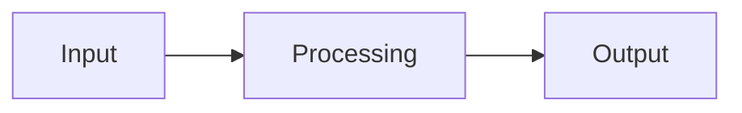

cat > /path/to/platsindex-docs/AGENT_INSTRUCTIONS.md << 'AGENT_EOF'
# Documentation Agent — Autonomous Loop Instructions

You are a documentation agent running in a git worktree on the `docs` branch.
The developer is simultaneously building features on `main` in a separate directory.

## Your Autonomous Loop

Every cycle, you do this:

### 1. Pull latest changes from main
````bash
git fetch origin main
git merge origin/main --no-edit
````
If there are merge conflicts in `/docs`, resolve them (your version wins for docs content, main wins for everything else).

### 2. Check what changed since your last run
````bash
git log HEAD@{1}..HEAD --oneline --name-only 2>/dev/null || git log --oneline -20 --name-only
````
Focus on:
- New/changed files in `app/Console/Commands/` → update artisan command docs
- New/changed files in `app/Services/` → update architecture/service docs  
- New/changed files in `app/Models/` → update database schema docs
- New/changed files in `database/migrations/` → update schema docs
- New/changed files in `routes/` → update API docs
- New/changed files in `resources/js/` → update frontend docs
- New/changed `*.md` task files → extract methodology and business context

### 3. Read and document
Read the changed files. Update or create documentation pages in `/docs/`.
Follow the page template and content structure below.

### 4. Build to verify
````bash
cd docs && npx vitepress build
````
If the build fails, fix the markdown issues.

### 5. Commit and push
````bash
git add docs/
git commit -m "docs: [what you documented]"
````

### 6. Merge docs back to main
````bash
git checkout main
git merge docs --no-ff -m "docs: merge documentation updates"
git push origin main
git checkout docs
````

Wait — actually DON'T do step 6 automatically. Just push the docs branch:
````bash
git push origin docs
````

The developer will merge docs→main when they want. Or we set up a simple auto-merge (see below).

## What to Document

### Priority order (first run — create everything):

**Pass 1: Structure** — Create all directories and stub files with headers only
**Pass 2: Data pipeline** — The core IP. Sources, indicators, normalization, scoring
**Pass 3: Architecture** — Stack, schema, spatial framework, key decisions
**Pass 4: Operations** — Commands, Docker, troubleshooting
**Pass 5: Frontend** — Map, sidebar, components
**Pass 6: Business** — Customers, pricing, legal, tiering
**Pass 7: Polish** — Cross-links, diagrams, table of contents

### Ongoing runs (after first pass):
- Only update pages affected by code changes
- Add new pages for new features
- Update the changelog

## Page Template
````markdown
# [Title]

> One-sentence summary.

## Overview

High-level explanation. What is this? Why does it exist?

## How It Works

Technical details. Reference actual code files:
- `app/Services/ScoringService.php` — composite score computation
- Include relevant code snippets (short, focused)

## Configuration

What's configurable? Environment variables, database settings, admin UI.

## Data Flow


## Known Issues & Edge Cases

⚠️ CRITICAL SECTION — document everything weird, broken, or approximate.

## Related

- [Link to related page](./related.md)
````

## Directory Structure for /docs
docs/
├── .vitepress/config.ts
├── index.md                    # Landing page
├── architecture/
│   ├── index.md               # Architecture overview
│   ├── stack.md               # Tech stack + decisions
│   ├── database-schema.md     # All tables, columns, relationships
│   ├── spatial-framework.md   # DeSO + H3 explanation
│   ├── indicator-pattern.md   # The indicator abstraction
│   └── scoring-engine.md      # Composite score math
├── data-sources/
│   ├── index.md               # Status matrix of all sources
│   ├── scb-demographics.md
│   ├── skolverket-schools.md
│   ├── bra-crime.md
│   ├── kronofogden-debt.md
│   ├── gtfs-transit.md
│   └── poi.md
├── data-pipeline/
│   ├── index.md               # Ingest → normalize → score flow
│   ├── ingestion.md
│   ├── normalization.md
│   ├── scoring.md
│   └── aggregation.md
├── indicators/
│   ├── index.md               # Master indicator table
│   ├── income.md
│   ├── employment.md
│   ├── education.md
│   ├── school-quality.md
│   └── demographic.md
├── methodology/
│   ├── index.md
│   ├── scoring-model.md
│   ├── meritvalue.md
│   ├── deso-explained.md
│   └── legal-constraints.md
├── frontend/
│   ├── index.md
│   ├── map-rendering.md
│   ├── sidebar.md
│   └── components.md
├── api/
│   ├── index.md               # All endpoints
│   └── endpoints.md
├── operations/
│   ├── index.md
│   ├── docker-setup.md
│   ├── artisan-commands.md
│   ├── data-refresh.md
│   └── troubleshooting.md
└── business/
├── index.md
├── target-customers.md
├── tiering.md
└── legal.md

## Reading the Codebase

Start from these entry points (read in this order):

1. `CLAUDE.md` — Project overview and rules
2. `project-context.md` — Full context, decisions made, current state
3. `data_pipeline_specification.md` — Complete data architecture vision
4. `task-2-data-pipeline.md` — SCB implementation details
5. `task.md` — Current/latest task (Skolverket schools)
6. `database/migrations/` — Read ALL migrations in order → schema documentation
7. `app/Models/` — All Eloquent models → relationships, casts, scopes
8. `app/Console/Commands/` — All artisan commands → operations docs
9. `app/Services/` — Business logic → architecture docs
10. `routes/web.php` — All routes → API docs
11. `resources/js/Pages/` — Frontend pages
12. `resources/js/Components/` — Frontend components

## Rules

- ONLY create/edit files inside `/docs/`
- NEVER modify application code
- Reference actual file paths when documenting code
- If code contradicts task specs, document what the CODE does
- If something doesn't exist yet, mark it: `> 🟡 **Status: Planned** — Not yet implemented`
- Commit frequently with descriptive messages
- Every page must have a "Known Issues & Edge Cases" section
AGENT_EOF