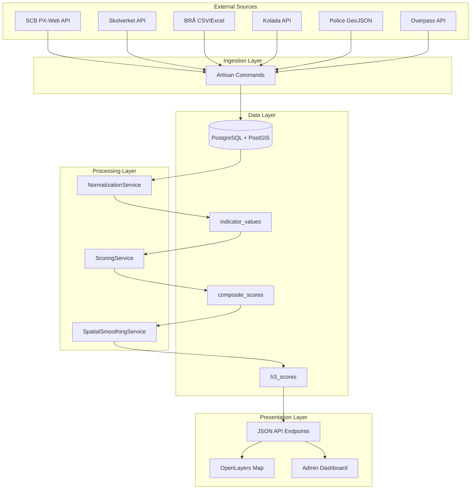

# Architecture Overview

> High-level architecture of the PlatsIndex platform — a monolithic Laravel application with spatial data processing.

## Overview

PlatsIndex is a monolithic Laravel 12 application that ingests public government data, normalizes it into indicators, computes composite neighborhood scores, and serves them through an interactive map. The system uses PostgreSQL with PostGIS for spatial queries and H3 hexagonal indexing for multi-resolution display.

The architecture follows a clear pipeline pattern: **Ingest → Normalize → Score → Serve**.

## System Diagram

## Key Design Decisions

| Decision | Choice | Rationale |
|---|---|---|
| Framework | Laravel 12 monolith | Periodic batch + read-heavy API; no microservice complexity needed |
| Frontend | Inertia.js + React 19 | SPA feel with server-side routing; shared auth/session |
| Map Library | OpenLayers | Open source, no API key, native vector tile support |
| Database | PostgreSQL + PostGIS | Spatial queries, H3 extension, mature ecosystem |
| Spatial Grid | H3 hexagonal | Uniform adjacency, multi-resolution, spatial smoothing |
| Primary Unit | DeSO (6,160 areas) | Finest-grained SCB statistical unit; all data converges here |

## Related

- [Tech Stack](/architecture/stack)
- [Database Schema](/architecture/database-schema)
- [Spatial Framework](/architecture/spatial-framework)
- [Indicator Pattern](/architecture/indicator-pattern)
- [Scoring Engine](/architecture/scoring-engine)
