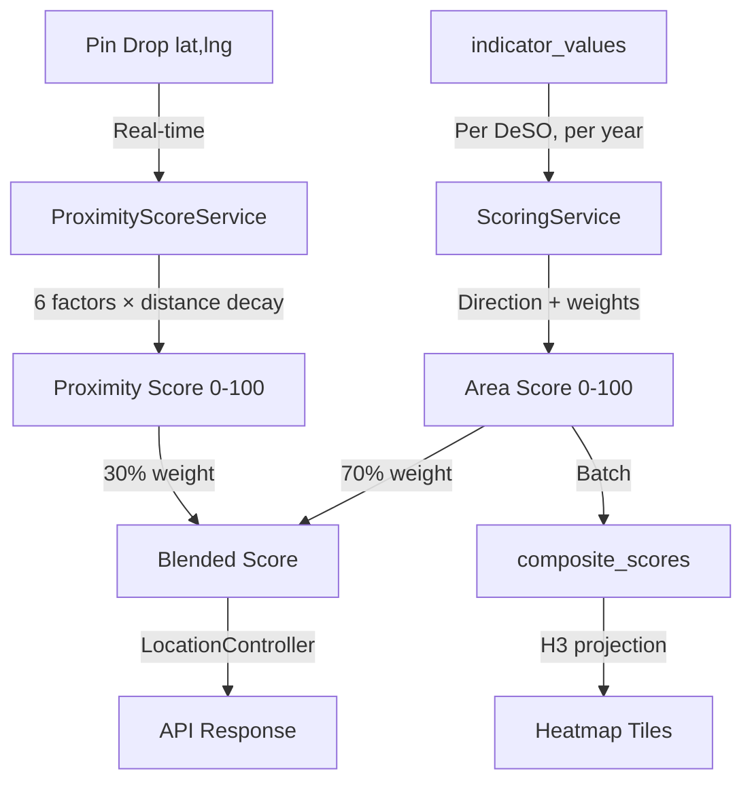

# Scoring Engine

> How composite neighborhood scores are computed — area-level indicators blended with per-address proximity scores.

## Overview

The scoring system has two layers:

1. **Area Score** (`ScoringService`) — Weighted composite of all DeSO-level indicators (income, crime, education, etc.), computed once per DeSO per year.
2. **Proximity Score** (`ProximityScoreService`) — Real-time scoring of a specific coordinate based on distance to nearby amenities, schools, and negative POIs.

The final **blended score** shown to users combines both:

```
blended = area_score × 0.70 + proximity_score × 0.30
```

This means two addresses in the same DeSO can have different scores based on what's walkable from each.

## Area Score (70%)

The `ScoringService` (`app/Services/ScoringService.php`) combines all active area-level indicators into a 0–100 composite score per DeSO. It handles direction inversion, weight application, missing data redistribution, and factor attribution.

### How It Works

### Step 1: Gather Indicator Values

For each DeSO, the engine loads all `indicator_values` for the target year where the associated indicator is active (`is_active = true`) and has a non-zero weight.

### Step 2: Direction Handling

Indicators with `direction = negative` are inverted so that higher always means better:

```php
// app/Services/ScoringService.php
$directedValue = match ($indicator->direction) {
    'positive' => $normalizedValue,
    'negative' => 1.0 - $normalizedValue,
    'neutral' => null, // excluded from scoring
};
```

### Step 3: Weight Redistribution

If a DeSO is missing data for some indicators, the weights of available indicators are proportionally scaled up to maintain a valid score:

```php
$availableWeightSum = sum of weights for indicators with data
$adjustedWeight = $indicator->weight / $availableWeightSum
```

This prevents DeSOs with sparse data from being systematically scored lower.

### Step 4: Weighted Sum

```php
$rawScore = Σ($directedValue × $adjustedWeight) × 100
```

The result is a score between 0 and 100.

### Step 5: Factor Attribution

The engine identifies the top contributing factors (positive and negative) for each DeSO:

```php
$factorScores = [
    'median_income' => $directedValue × $weight,
    'crime_total_rate' => $directedValue × $weight,
    // ...
];

// Sort by absolute contribution
$topPositive = top 3 factors with highest positive contribution
$topNegative = top 3 factors with highest negative contribution
```

These are stored as JSON in `composite_scores.top_positive` and `composite_scores.top_negative`.

### Step 6: Versioning

Each scoring run creates a `ScoreVersion` record. Scores are initially `draft` and must be explicitly published via the admin dashboard. This allows review before scores go live.

## Proximity Score (30%)

The `ProximityScoreService` (`app/Services/ProximityScoreService.php`) computes a real-time 0–100 score for any coordinate. It runs on every pin drop and must complete in **< 200ms**.

### Proximity Factors

| Factor | Slug | Radius | Default Weight | Scoring Logic |
|---|---|---|---|---|
| School Quality | `prox_school` | 2 km | 0.10 | Best school's merit × distance decay |
| Green Space | `prox_green_space` | 1 km | 0.04 | Distance to nearest park/nature reserve |
| Transit Access | `prox_transit` | 1 km | 0.05 | Nearest stop distance + mode bonus (rail 1.5×, tram 1.2×) + count bonus |
| Grocery Access | `prox_grocery` | 1 km | 0.03 | Distance to nearest grocery store |
| Negative POIs | `prox_negative_poi` | 500 m | 0.04 | Penalty per nearby negative POI (gambling, pawn shops) |
| Positive POIs | `prox_positive_poi` | 1 km | 0.04 | Bonus from amenities with diminishing returns |

All factors use **linear distance decay**: `score = 1 - (distance / maxDistance)`.

### Distance Decay

Each factor computes a 0–100 sub-score using PostGIS `ST_DWithin` for candidate selection and `ST_Distance` for precise measurement:

```sql
ST_DWithin(geom::geography, ST_SetSRID(ST_MakePoint(lng, lat), 4326)::geography, radius_meters)
```

### Safety-Modulated Distance Decay

Proximity scores are adjusted by area safety. The `SafetyScoreService` computes a 0.0–1.0 safety score per DeSO from crime indicators (75%) and socioeconomic proxies (25%). Each POI category has a `safety_sensitivity` value (0.0–1.5) that controls how much safety context affects its proximity score.

```
effective_distance = physical_distance × (1.0 + (1.0 - safety_score) × sensitivity)
```

This means a park 500m away in an unsafe area (safety 0.15) feels much further than the same park in a safe area (safety 0.90). Necessities like grocery (sensitivity 0.3) are barely affected; nightlife (sensitivity 1.5) is strongly affected.

### Weight Source

Proximity weights are read from the `indicators` table (category = `proximity`) and cached for 5 minutes. The `ProximityResult` DTO uses defaults if no DB weights exist.

### Score Blending

**File**: `app/Http/Controllers/LocationController.php`

```php
const AREA_WEIGHT = 0.70;
const PROXIMITY_WEIGHT = 0.30;

$blendedScore = $areaScore * 0.70 + $proximityScore * 0.30;
```

If no area score exists for a DeSO, a default area score of 50 is assumed.

### Weight Rebalancing

When proximity indicators were introduced, area-level weights were scaled by 0.753 so that:
- Area indicators sum to ~0.70
- Proximity indicators sum to 0.30
- Total = 1.00

This rebalancing is handled by `ProximityIndicatorSeeder`.

## Score Interpretation

| Score Range | Swedish Label | English Label |
|---|---|---|
| 80–100 | Starkt tillväxtområde | Strong Growth Area |
| 60–79 | Stabilt / Positivt | Stable / Positive |
| 40–59 | Blandat | Mixed Signals |
| 20–39 | Förhöjd risk | Elevated Risk |
| 0–19 | Hög risk | High Risk |

## Multi-Tenancy

Enterprise tenants can customize scoring through `tenant_indicator_weights`:

- Override weight, direction, and active status per indicator
- Tenant-specific score versions are computed and published separately
- Default (null tenant) scores serve as fallback

## Data Flow



## Artisan Commands

| Command | Purpose |
|---|---|
| `compute:scores --year=2024` | Compute composite scores for all DeSOs |
| `publish:scores {versionId}` | Publish a draft version |
| `rollback:scores {versionId}` | Roll back to previous version |

## Known Issues & Edge Cases

- **Weight sum validation**: The admin UI warns if active indicator weights don't sum to 1.0, but doesn't block scoring.
- **Sparse data DeSOs**: Very remote areas may only have 3–4 indicators with data. Weight redistribution handles this but scores are less reliable.
- **Neutral direction**: Indicators with `direction = neutral` are excluded from scoring entirely (used for informational display only).
- **Score drift detection**: The `ScoreDriftDetector` service monitors for unusual changes between versions.

## Related

- [Indicator Pattern](/architecture/indicator-pattern)
- [Normalization](/data-pipeline/normalization)
- [Scoring Pipeline](/data-pipeline/scoring)
- [Admin Dashboard](/frontend/admin-dashboard)
