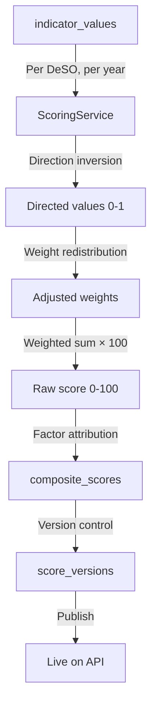

# Scoring Engine

> How composite neighborhood scores are computed from individual indicators.

## Overview

The scoring engine (`app/Services/ScoringService.php`) combines all active indicators into a single 0–100 composite score per DeSO area. It handles direction inversion, weight application, missing data redistribution, and factor attribution.

## How It Works

### Step 1: Gather Indicator Values

For each DeSO, the engine loads all `indicator_values` for the target year where the associated indicator is active (`is_active = true`) and has a non-zero weight.

### Step 2: Direction Handling

Indicators with `direction = negative` are inverted so that higher always means better:

```php
// app/Services/ScoringService.php
$directedValue = match ($indicator->direction) {
    'positive' => $normalizedValue,
    'negative' => 1.0 - $normalizedValue,
    'neutral' => null, // excluded from scoring
};
```

### Step 3: Weight Redistribution

If a DeSO is missing data for some indicators, the weights of available indicators are proportionally scaled up to maintain a valid score:

```php
$availableWeightSum = sum of weights for indicators with data
$adjustedWeight = $indicator->weight / $availableWeightSum
```

This prevents DeSOs with sparse data from being systematically scored lower.

### Step 4: Weighted Sum

```php
$rawScore = Σ($directedValue × $adjustedWeight) × 100
```

The result is a score between 0 and 100.

### Step 5: Factor Attribution

The engine identifies the top contributing factors (positive and negative) for each DeSO:

```php
$factorScores = [
    'median_income' => $directedValue × $weight,
    'crime_total_rate' => $directedValue × $weight,
    // ...
];

// Sort by absolute contribution
$topPositive = top 3 factors with highest positive contribution
$topNegative = top 3 factors with highest negative contribution
```

These are stored as JSON in `composite_scores.top_positive` and `composite_scores.top_negative`.

### Step 6: Versioning

Each scoring run creates a `ScoreVersion` record. Scores are initially `draft` and must be explicitly published via the admin dashboard. This allows review before scores go live.

## Score Interpretation

| Score Range | Label | Color |
|---|---|---|
| 80–100 | Strong Growth Area | Dark Green |
| 60–79 | Stable / Positive Outlook | Light Green |
| 40–59 | Mixed Signals | Yellow |
| 20–39 | Elevated Risk | Orange |
| 0–19 | High Risk / Declining | Red |

## Multi-Tenancy

Enterprise tenants can customize scoring through `tenant_indicator_weights`:

- Override weight, direction, and active status per indicator
- Tenant-specific score versions are computed and published separately
- Default (null tenant) scores serve as fallback

## Data Flow



## Artisan Commands

| Command | Purpose |
|---|---|
| `compute:scores --year=2024` | Compute composite scores for all DeSOs |
| `publish:scores {versionId}` | Publish a draft version |
| `rollback:scores {versionId}` | Roll back to previous version |

## Known Issues & Edge Cases

- **Weight sum validation**: The admin UI warns if active indicator weights don't sum to 1.0, but doesn't block scoring.
- **Sparse data DeSOs**: Very remote areas may only have 3–4 indicators with data. Weight redistribution handles this but scores are less reliable.
- **Neutral direction**: Indicators with `direction = neutral` are excluded from scoring entirely (used for informational display only).
- **Score drift detection**: The `ScoreDriftDetector` service monitors for unusual changes between versions.

## Related

- [Indicator Pattern](/architecture/indicator-pattern)
- [Normalization](/data-pipeline/normalization)
- [Scoring Pipeline](/data-pipeline/scoring)
- [Admin Dashboard](/frontend/admin-dashboard)
