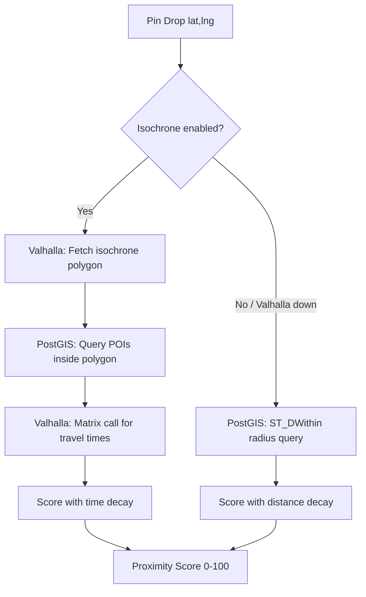
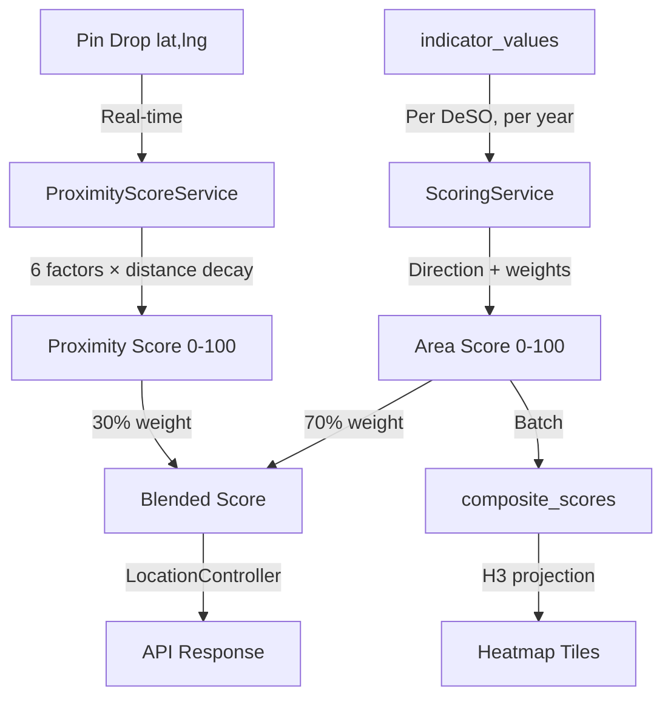

# Scoring Engine

> How composite neighborhood scores are computed — area-level indicators blended with per-address proximity scores.

## Overview

The scoring system has two layers:

1. **Area Score** (`ScoringService`) — Weighted composite of all DeSO-level indicators (income, crime, education, etc.), computed once per DeSO per year.
2. **Proximity Score** (`ProximityScoreService`) — Real-time scoring of a specific coordinate based on distance to nearby amenities, schools, and negative POIs.

The final **blended score** shown to users combines both:

```
blended = area_score × 0.70 + proximity_score × 0.30
```

This means two addresses in the same DeSO can have different scores based on what's walkable from each.

## Area Score (70%)

The `ScoringService` (`app/Services/ScoringService.php`) combines all active area-level indicators into a 0–100 composite score per DeSO. It handles direction inversion, weight application, missing data redistribution, and factor attribution.

### How It Works

### Step 1: Gather Indicator Values

For each DeSO, the engine loads all `indicator_values` for the target year where the associated indicator is active (`is_active = true`) and has a non-zero weight.

### Step 2: Direction Handling

Indicators with `direction = negative` are inverted so that higher always means better:

```php
// app/Services/ScoringService.php
$directedValue = match ($indicator->direction) {
    'positive' => $normalizedValue,
    'negative' => 1.0 - $normalizedValue,
    'neutral' => null, // excluded from scoring
};
```

### Step 3: Weight Redistribution

If a DeSO is missing data for some indicators, the weights of available indicators are proportionally scaled up to maintain a valid score:

```php
$availableWeightSum = sum of weights for indicators with data
$adjustedWeight = $indicator->weight / $availableWeightSum
```

This prevents DeSOs with sparse data from being systematically scored lower.

### Step 4: Weighted Sum

```php
$rawScore = Σ($directedValue × $adjustedWeight) × 100
```

The result is a score between 0 and 100.

### Step 5: Score Penalties

After computing the raw weighted score, the engine applies **penalties** — hard deductions that exist outside the weighted indicator system. Penalties are defined in the `score_penalties` table and applied post-calculation.

```php
// app/Services/ScoringService.php — computePenalties()
// 1. Load all active penalties and DeSO vulnerability mappings (≥10% overlap)
// 2. Group applicable penalties by category
// 3. Select worst (most negative) penalty per category
// 4. Sum across categories
$totalPenalty = sum of worst-per-category penalties
$finalScore = clamp($rawScore + $totalPenalty, 0, 100)
```

**Current penalties:**

| Penalty | Slug | Value | Type | Trigger |
|---|---|---|---|---|
| Särskilt utsatt område | `vuln_sarskilt_utsatt` | -15 pts | absolute | Police-classified severely vulnerable area |
| Utsatt område | `vuln_utsatt` | -8 pts | absolute | Police-classified vulnerable area |

Penalties apply when a DeSO has ≥10% spatial overlap with a vulnerability area (via `deso_vulnerability_mapping`). Both penalty types support `absolute` (fixed deduction) and `percentage` (% of raw score) modes.

**Audit trail**: When penalties are applied, `composite_scores` stores:
- `raw_score_before_penalties` — the pre-penalty score
- `penalties_applied` — JSON array with slug, name, and amount for each applied penalty

This replaced the earlier `vulnerability_flag` indicator (weight 0.10), which modeled vulnerability as a continuous 0/1/2 value within the weighted sum. The penalty approach gives clearer separation between data-driven scoring and policy-driven adjustments. The old indicator's weight was redistributed to crime indicators (`crime_violent_rate` +0.02, `crime_property_rate` +0.01, `perceived_safety` +0.015).

### Step 6: Factor Attribution

The engine identifies the top contributing factors (positive and negative) for each DeSO:

```php
$factorScores = [
    'median_income' => $directedValue × $weight,
    'crime_total_rate' => $directedValue × $weight,
    // ...
];

// Sort by absolute contribution
$topPositive = top 3 factors with highest positive contribution
$topNegative = top 3 factors with highest negative contribution
```

These are stored as JSON in `composite_scores.top_positive` and `composite_scores.top_negative`.

### Step 7: Versioning

Each scoring run creates a `ScoreVersion` record. Scores are initially `draft` and must be explicitly published via the admin dashboard. This allows review before scores go live.

## Proximity Score (30%)

The `ProximityScoreService` (`app/Services/ProximityScoreService.php`) computes a real-time 0–100 score for any coordinate. It uses **isochrone-based scoring** (walking/driving time via Valhalla) with a fallback to radius-based scoring.

### Isochrone vs Radius Scoring

The service has two code paths:

1. **Isochrone mode** (default when Valhalla is available): Uses `IsochroneService` to fetch a travel-time polygon from Valhalla, queries all POIs/schools/transit within the reachable area, then gets actual travel times via a Valhalla matrix call. Scores use **time decay** instead of distance decay.
2. **Radius fallback**: When Valhalla is unavailable, falls back to straight-line `ST_DWithin` queries with distance decay. Seamless — no user-facing error.

### Isochrone Architecture



The `IsochroneService` (`app/Services/IsochroneService.php`) manages all Valhalla interactions:
- **`generate()`** — Fetches multi-contour isochrone polygons (e.g., 5/10/15 min walking). Cached by ~100m grid cell (3600s TTL).
- **`outermostPolygonWkt()`** — Extracts the largest contour as WKT for PostGIS `ST_Contains()` queries.
- **`travelTimes()`** — Matrix endpoint for actual travel times to multiple targets. Chunked at 50 targets per API call.

### Proximity Factors

Scoring parameters adapt to **urbanity tier**. In isochrone mode, times are used; in radius mode, distances are used as fallback.

| Factor | Slug | Weight | Urban | Semi-Urban | Rural |
|---|---|---|---|---|---|
| School Quality | `prox_school` | 0.10 | 15 min / 1,500 m | 15 min / 2,000 m | 20 min / 3,500 m |
| Green Space | `prox_green_space` | 0.04 | 10 min / 1,000 m | 10 min / 1,500 m | 15 min / 2,500 m |
| Transit Access | `prox_transit` | 0.05 | 8 min / 800 m | 10 min / 1,200 m | 15 min / 2,500 m |
| Grocery Access | `prox_grocery` | 0.03 | 10 min / 800 m | 10 min / 1,200 m | 15 min / 2,000 m |
| Negative POIs | `prox_negative_poi` | 0.04 | 400 m | 500 m | 500 m |
| Positive POIs | `prox_positive_poi` | 0.04 | 800 m | 1,000 m | 1,500 m |

Travel mode per urbanity tier: **pedestrian** (urban, semi-urban), **auto** (rural).

Isochrone display contours shown on the map: 5/10/15 min (urban, semi-urban), 5/10/20 min (rural).

Configuration in `config/proximity.php` under `isochrone`, `scoring_times`, and `scoring_radii` sections.

### Safety-Modulated Time/Distance Decay

Proximity scores are adjusted by area safety. The `SafetyScoreService` computes a 0.0–1.0 safety score per DeSO from crime indicators (75%) and socioeconomic proxies (25%). Each POI category has a `safety_sensitivity` value (0.0–1.5) that controls how much safety context affects its proximity score.

In isochrone mode:
```
effective_time = travel_seconds × (1.0 + (1.0 - safety_score) × sensitivity)
```

In radius fallback mode:
```
effective_distance = physical_distance × (1.0 + (1.0 - safety_score) × sensitivity)
```

This means a park at 8 minutes walking in an unsafe area (safety 0.15) scores as if it were much further. Necessities like grocery (sensitivity 0.3) are barely affected; nightlife (sensitivity 1.5) is strongly affected.

### Weight Source

Proximity weights are read from the `indicators` table (category = `proximity`) and cached for 5 minutes. The `ProximityResult` DTO uses defaults if no DB weights exist.

### Score Blending

**File**: `app/Http/Controllers/LocationController.php`

```php
const AREA_WEIGHT = 0.70;
const PROXIMITY_WEIGHT = 0.30;

$blendedScore = $areaScore * 0.70 + $proximityScore * 0.30;
```

If no area score exists for a DeSO, a default area score of 50 is assumed.

### Weight Rebalancing

When proximity indicators were introduced, area-level weights were scaled by 0.753 so that:
- Area indicators sum to ~0.70
- Proximity indicators sum to 0.30
- Total = 1.00

This rebalancing is handled by `ProximityIndicatorSeeder`.

## Score Interpretation

Labels and colors are defined in `config/score_colors.php` and read by both backend (`LocationController::scoreLabel()`) and frontend (`score-colors.ts`).

| Score Range | Swedish Label | English Label | Color |
|---|---|---|---|
| 80–100 | Starkt tillväxtområde | Strong Growth Area | `#1a7a2e` |
| 60–79 | Stabil / positiv utsikt | Stable / Positive Outlook | `#27ae60` |
| 40–59 | Blandade signaler | Mixed Signals | `#f1c40f` |
| 20–39 | Förhöjd risk | Elevated Risk | `#e74c3c` |
| 0–19 | Hög risk / vikande | High Risk / Declining | `#c0392b` |

### Color Scale

Red-to-green gradient with 7 stops, used across heatmap tiles, sidebar score badges, indicator bars, school markers, and the map legend:

| Score | Color | Hex |
|---|---|---|
| 0 | Deep red | `#c0392b` |
| 25 | Red | `#e74c3c` |
| 40 | Amber | `#f39c12` |
| 50 | Yellow | `#f1c40f` |
| 60 | Yellow | `#f1c40f` |
| 75 | Green | `#27ae60` |
| 100 | Deep green | `#1a7a2e` |

## Multi-Tenancy

Enterprise tenants can customize scoring through `tenant_indicator_weights`:

- Override weight, direction, and active status per indicator
- Tenant-specific score versions are computed and published separately
- Default (null tenant) scores serve as fallback

## Data Flow



## Artisan Commands

| Command | Purpose |
|---|---|
| `compute:scores --year=2024` | Compute composite scores for all DeSOs |
| `publish:scores {versionId}` | Publish a draft version |
| `rollback:scores {versionId}` | Roll back to previous version |

## Known Issues & Edge Cases

- **Weight sum validation**: The admin UI warns if active indicator weights don't sum to 1.0, but doesn't block scoring.
- **Sparse data DeSOs**: Very remote areas may only have 3–4 indicators with data. Weight redistribution handles this but scores are less reliable.
- **Neutral direction**: Indicators with `direction = neutral` are excluded from scoring entirely (used for informational display only).
- **Score drift detection**: The `ScoreDriftDetector` service monitors for unusual changes between versions.
- **Penalty stacking**: Only the worst penalty per category is applied (e.g., if a DeSO overlaps both "utsatt" and "särskilt utsatt" areas, only -15 is applied, not -23).
- **Penalty floor**: Scores are clamped to [0, 100] after penalty application — a raw score of 12 with a -15 penalty floors at 0.
- **Penalty admin**: Penalty values can be adjusted at `/admin/penalties` but require re-running `compute:scores` to take effect.

## Related

- [Indicator Pattern](/architecture/indicator-pattern)
- [Normalization](/data-pipeline/normalization)
- [Scoring Pipeline](/data-pipeline/scoring)
- [Admin Dashboard](/frontend/admin-dashboard)
