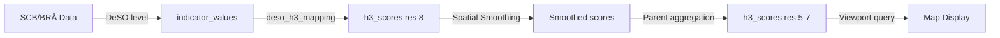

# Spatial Framework

> How DeSO areas and H3 hexagons work together as the platform's geographic backbone.

## Overview

PlatsIndex uses two complementary spatial systems:

1. **DeSO (Demografiska statistikområden)** — SCB's statistical areas (6,160 polygons) as the primary data anchor. All government statistics are published at this level.
2. **H3 Hexagonal Grid** — Uber's hierarchical spatial index for multi-resolution display, spatial smoothing, and cross-source joins.

Data flows from sources → DeSO-level indicators → H3 hexagons for display.

## DeSO Areas

DeSO areas are maintained by Statistics Sweden (SCB). They subdivide all of Sweden into areas of approximately 700–2,700 inhabitants, respecting geographic features like streets, rivers, and railways.

| Property | Value |
|---|---|
| Total count | 6,160 (DeSO 2025 revision) |
| Previous count | 5,984 (DeSO 2018) |
| Population per unit | ~700–2,700 inhabitants |
| Maintained by | SCB (Statistics Sweden) |
| Geometry format | GeoPackage/GeoJSON from SCB geodata portal |
| Coordinate system | EPSG:4326 (WGS84) stored in PostGIS |
| Parent geographies | RegSO → Kommun → Län |

### DeSO Code Format

DeSO codes follow the pattern `KKKKXNNNN` where:
- `KKKK` = kommun code (4 digits)
- `X` = letter A–Z (subdivision)
- `NNNN` = numeric identifier

Example: `0114A0010` = Kommun 0114 (Upplands Väsby), area A0010.

### DeSO 2025 Revision

In 2025, SCB revised DeSO boundaries, increasing the count from 5,984 to 6,160. The platform handles this via:

- `deso_boundary_changes` table tracks which areas were split, merged, or unchanged
- `deso_code_mappings` maps old codes to new codes
- `trend_eligible` flag on `deso_areas` marks whether trends can be computed (false for changed areas)

## H3 Hexagonal Grid

H3 cells provide uniform spatial analysis. Every hexagon has exactly 6 neighbors at equal distance, making spatial smoothing mathematically clean.

### Resolution Mapping

| H3 Resolution | Avg Hex Area | OpenLayers Zoom | Use Case |
|---|---|---|---|
| 5 | ~252 km² | ≤6 | Country-level overview |
| 6 | ~36 km² | 7–8 | Regional view |
| 7 | ~5.16 km² | 9–10 | Municipal detail |
| **8** | **~0.74 km²** | **11+** | **Primary analysis resolution** |

Resolution 8 is the primary working resolution — at ~0.74 km² per hex, it aligns well with DeSO areas which average ~1–5 km² in urban zones.

### Zoom-to-Resolution Mapping

The `H3Controller` maps OpenLayers zoom levels to H3 resolutions:

```php
// app/Http/Controllers/H3Controller.php
private function zoomToResolution(int $zoom): int
{
    return match (true) {
        $zoom <= 6 => 5,
        $zoom <= 8 => 6,
        $zoom <= 10 => 7,
        default => 8,
    };
}
```

### DeSO → H3 Mapping

The `deso_h3_mapping` table pre-computes which H3 cells overlap with each DeSO polygon, with area weights. This is built by the `build:deso-h3-mapping` command using PostGIS `h3_polygon_to_cells()`.

### Spatial Smoothing

The `SpatialSmoothingService` applies neighbor-weighted smoothing to H3 scores:

- Self-weight and neighbor-weight are configurable via `smoothing_configs`
- Uses k-ring neighbors (typically k=1)
- Decay function controls how weight drops with distance
- Scores at lower resolutions (5, 6, 7) are pre-aggregated

### Viewport Loading

The H3 viewport endpoint (`/api/h3/viewport`) uses a bounding-box approach:
1. Client sends bbox + zoom level
2. Server clamps to Sweden's bounds (lat 55.2–69.1, lng 10.5–24.2)
3. H3 cells are computed for the viewport at the appropriate resolution
4. Pre-computed scores are joined and returned

## Data Flow



## Known Issues & Edge Cases

- **DeSO 2025 boundary changes**: ~176 areas changed. Trends cannot be computed for these areas. The `trend_eligible` flag prevents stale trend display.
- **SCB API suffix**: DeSO 2025 codes have a `_DeSO2025` suffix in API responses that must be stripped with `extractDesoCode()`.
- **H3 edge cells**: Some H3 cells at Sweden's borders partially extend over water or into Norway/Finland. These are included but have no DeSO assignment.
- **Resolution mismatch**: A single DeSO may overlap with 2–15 resolution-8 hexes depending on urban density.

## Related

- [Architecture Overview](/architecture/)
- [Database Schema](/architecture/database-schema)
- [DeSO Explained](/methodology/deso-explained)
