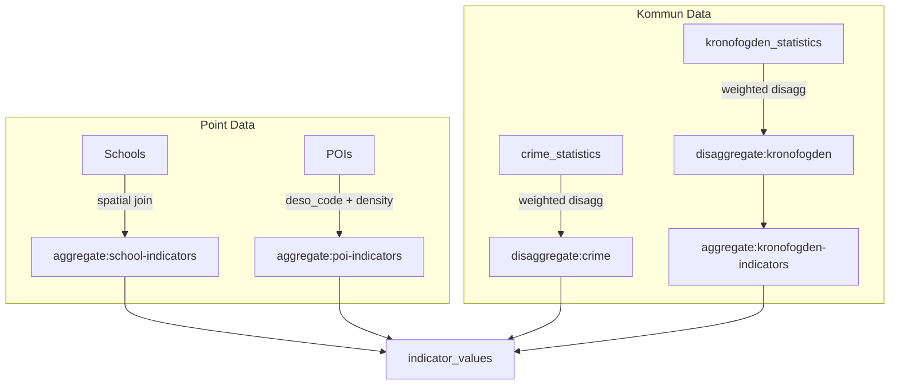

# Aggregation

> How point-level and kommun-level data is transformed into DeSO-level indicators.

## Overview

Not all data sources provide values at DeSO level. Schools are points, crime is at kommun level, debt is at kommun level, and POIs are points. Aggregation and disaggregation commands transform these into DeSO-level `indicator_values`.

## School Aggregation (`aggregate:school-indicators`)

Aggregates school-level statistics to DeSO averages.

```bash
php artisan aggregate:school-indicators --academic-year=2020/21 --calendar-year=2024
```

### How It Works

1. Groups active schools by `deso_code`
2. For each DeSO with schools:
   - **merit_value_avg**: Average `merit_value_17` across all schools
   - **goal_achievement_avg**: Average `goal_achievement_pct`
   - **teacher_certification_avg**: Average `teacher_certification_pct`
3. Upserts into `indicator_values` with the corresponding indicator IDs

### Key Notes

- Teacher certification has much better coverage than merit/achievement data
- Academic year `2020/21` is used because Skolverket restricted publication after that
- DeSOs without schools get NULL indicator values (no interpolation)

## POI Aggregation (`aggregate:poi-indicators`)

Computes POI density per capita for each DeSO.

```bash
php artisan aggregate:poi-indicators
```

### How It Works

1. Counts active POIs per DeSO per category (using `deso_code` from the `pois` table)
2. Computes per-capita density: `count / (population / 1000)`
3. Creates indicators for positive and negative POI density
4. Uses catchment radius (from `poi_categories`) rather than strict DeSO boundaries

### Key Notes

- Zero POIs is data (stored as 0.0), not missing data
- Per-capita density prevents large DeSOs from dominating
- Normalization uses urbanity-stratified scope

## Crime Disaggregation (`disaggregate:crime`)

Disaggregates kommun-level crime rates to DeSO estimates using demographic weighting.

```bash
php artisan disaggregate:crime --year=2024
```

### How It Works

1. Loads kommun-level crime rates from `crime_statistics`
2. Loads NTU survey data at län level from `ntu_survey_data`
3. For each DeSO within a kommun:
   - Computes a **propensity weight** based on demographic factors:
     - Income (35% weight in formula)
     - Employment (20%)
     - Education (15%)
     - Vulnerability area overlap (30% + 20% bonus for "särskilt utsatt")
   - Applies weighted distribution: high-propensity DeSOs get higher crime estimates
4. **Constraint**: Population-weighted DeSO average must match kommun rate exactly
5. Creates `indicator_values` for crime indicators

### Crime Indicators Created

| Indicator | Direction | Description |
|---|---|---|
| `crime_total_rate` | negative | Total reported crimes per 100k |
| `crime_violent_rate` | negative | Violent crimes per 100k |
| `crime_property_rate` | negative | Property crimes per 100k |
| `perceived_safety` | positive | % feeling safe at night (inverted from NTU) |
| `vulnerability_score` | negative | Police vulnerability tier (0/1/2) |

## Kronofogden Disaggregation (`disaggregate:kronofogden`)

Disaggregates kommun-level debt rates to DeSO estimates.

```bash
php artisan disaggregate:kronofogden --year=2024
```

### How It Works

1. Loads kommun-level data from `kronofogden_statistics`
2. For each DeSO, computes propensity weight using:
   - Income (35%)
   - Employment (20%)
   - Education (15%)
   - Low economic standard (15%)
   - Vulnerability area (15% + 10% bonus)
3. Distributes kommun rates to DeSOs proportionally
4. **Clamps** estimates to 10%–300% of kommun rate
5. **Constrains** so population-weighted average matches kommun total
6. Stores in `debt_disaggregation_results`

### Kronofogden Indicator Aggregation (`aggregate:kronofogden-indicators`)

```bash
php artisan aggregate:kronofogden-indicators --year=2024
```

Creates `indicator_values` from disaggregation results:

| Indicator | Weight | Direction | Notes |
|---|---|---|---|
| `debt_rate_pct` | 0.06 | negative | Estimated % with debt at Kronofogden |
| `eviction_rate` | 0.04 | negative | Estimated eviction rate per 100k |
| `median_debt_sek` | 0.02 | negative | Kommun-level only (can't disaggregate a median) |

### Key Notes

- `median_debt_sek` is flat for all DeSOs in a kommun — medians can't be spatially disaggregated
- R² = 0.4030 for cross-validation (demographics explain ~40% of debt rate variance)
- Does NOT use `foreign_background_pct` in the disaggregation formula (legal constraint)

## Data Flow



## Known Issues & Edge Cases

- **Disaggregation precision**: The crime and debt disaggregation models explain ~40% of variance. DeSO-level estimates are approximations, not ground truth.
- **Empty DeSOs**: Some DeSOs have no schools, no POIs, and sparse demographic data. These get fewer indicator values and rely on weight redistribution during scoring.
- **Kommun constraint**: The constraint that DeSO estimates must average back to the kommun total ensures consistency but can push extreme DeSOs toward the mean.

## Related

- [Data Pipeline Overview](/data-pipeline/)
- [Disaggregation Methodology](/methodology/disaggregation)
- [Crime Data Source](/data-sources/bra-crime)
- [Kronofogden Data Source](/data-sources/kronofogden-debt)
