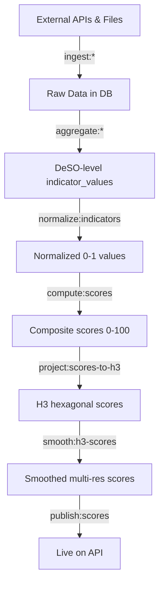
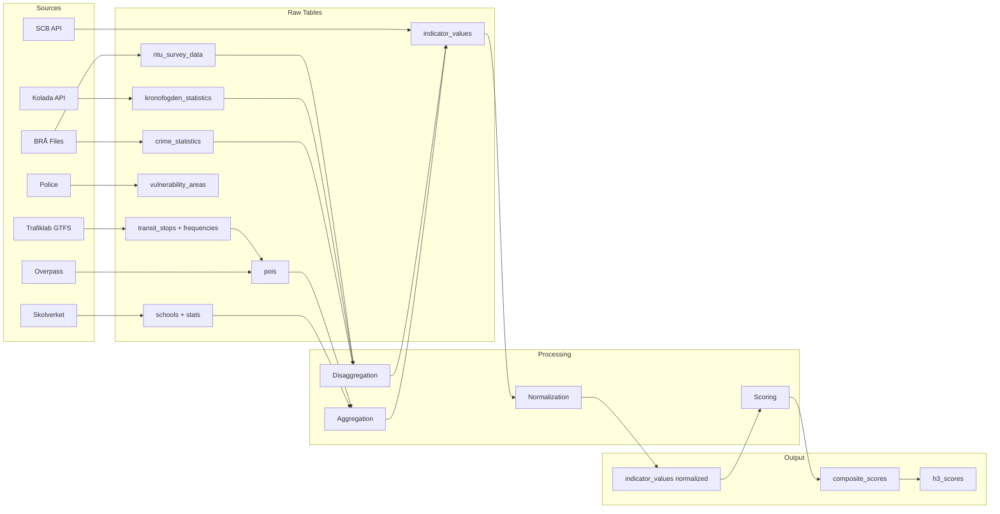

# Data Pipeline Overview

> The complete journey from external data sources to map-ready composite scores.

## Overview

The PlatsIndex data pipeline transforms raw government statistics into neighborhood scores through five stages. Each stage is implemented as one or more Laravel Artisan commands that can be run independently or orchestrated together via `pipeline:run`.

## Pipeline Stages



### Stage 1: Ingestion

Artisan commands fetch data from external sources and store raw values in source-specific tables.

| Command | Source | Output Table |
|---|---|---|
| `ingest:scb --all` | SCB PX-Web API | `indicator_values` (directly) |
| `ingest:scb-historical` | SCB PX-Web API (old DeSO codes) | `indicator_values` (via crosswalk) |
| `ingest:skolverket-schools` | Skolverket v2 API | `schools` |
| `ingest:skolverket-stats` | Skolverket v3 API | `school_statistics` |
| `ingest:bra-crime --year=2024` | BRÅ CSV/Excel files | `crime_statistics` |
| `ingest:bra-historical` | BRÅ SOL Excel export | `crime_statistics` (multi-year) |
| `ingest:ntu --year=2025` | BRÅ NTU Excel | `ntu_survey_data` |
| `ingest:vulnerability-areas` | Police GeoJSON | `vulnerability_areas` |
| `ingest:kronofogden --year=2024` | Kolada API | `kronofogden_statistics` |
| `ingest:gtfs` | Trafiklab GTFS Sverige 2 | `transit_stops`, `transit_stop_frequencies`, `pois` |
| `ingest:pois` | OSM Overpass API | `pois` |

### Stage 2: Aggregation & Disaggregation

Some data sources need spatial transformation before becoming DeSO-level indicators.

| Command | What It Does |
|---|---|
| `aggregate:school-indicators` | Average school stats per DeSO |
| `aggregate:poi-indicators` | POI density per capita per DeSO |
| `aggregate:kronofogden-indicators` | Create indicators from disaggregation results |
| `disaggregate:crime --year=2024` | Kommun/län crime rates → DeSO estimates |
| `disaggregate:kronofogden --year=2024` | Kommun debt rates → DeSO estimates |

### Stage 3: Normalization

The `normalize:indicators` command converts all raw values to a 0–1 scale:

- **National scope**: `PERCENT_RANK() OVER (ORDER BY raw_value)` across all 6,160 DeSOs
- **Urbanity-stratified**: Percentile rank within each urbanity tier (urban/semi-urban/rural)

See [Normalization](/data-pipeline/normalization) for details.

### Stage 3.5: Validation

The `validate:indicators` command runs sanity checks against known reference points before scoring:

- **Kommun-level average checks**: Verifies that averages for well-known municipalities fall within expected ranges (e.g., Danderyd income 350k–700k SEK, Lund post-secondary 40–85%)
- **National median checks**: Ensures national median percentiles are reasonable

Configuration in `config/data_sanity_checks.php`. Run after normalization, before scoring.

### Stage 4: Scoring

The `compute:scores` command produces composite 0–100 scores:

1. Load all active indicators with their weights and directions
2. For each DeSO, compute weighted sum of directed normalized values
3. Apply [score penalties](/architecture/scoring-engine#step-5-score-penalties) (vulnerability area deductions)
4. Identify top positive and negative contributing factors
5. Store in `composite_scores` with a draft `score_version`

See [Scoring](/data-pipeline/scoring) for details.

### Stage 5: H3 Projection & Smoothing

| Command | What It Does |
|---|---|
| `project:scores-to-h3` | Map DeSO scores to H3 resolution 8 cells |
| `smooth:h3-scores` | Apply spatial smoothing and aggregate to resolutions 5–7 |

### Stage 6: Publishing

The `publish:scores` command makes a draft score version live. Scores can be rolled back with `rollback:scores`.

## Full Pipeline Command

The `pipeline:run` command orchestrates all stages:

```bash
php artisan pipeline:run --source=all --year=2024 --auto-publish
```

Options:
- `--source=all|scb|skolverket|bra|kronofogden` — Which sources to ingest
- `--year=2024` — Target year (defaults to previous year)
- `--auto-publish` — Publish automatically if all validation checks pass

## Data Flow Diagram



## Scheduling

Most sources update annually. The recommended schedule:

| Frequency | Commands |
|---|---|
| Annual (Q1) | `ingest:scb`, `ingest:kronofogden`, `ingest:bra-crime`, `ingest:ntu` |
| Monthly | `ingest:skolverket-schools`, `ingest:skolverket-stats`, `ingest:pois` |
| After ingestion | `normalize:indicators`, `compute:scores` |
| Manual | `ingest:vulnerability-areas` (updates ~every 2 years) |

## Known Issues & Edge Cases

- **Memory**: Large SCB API responses require `memory_limit=1G` on the ingestion commands.
- **Bulk operations**: All ingestion commands use `DB::table()->upsert()` with chunks of 1,000 to avoid memory exhaustion. Individual `updateOrCreate` in loops does not scale to 6,160+ rows × 20 indicators.
- **Order dependency**: Normalization must run after all ingestion is complete. Scoring must run after normalization. H3 projection after scoring. These are sequential dependencies.
- **Idempotency**: All commands are idempotent — running them multiple times produces the same result via upsert operations.

## Related

- [Ingestion](/data-pipeline/ingestion)
- [Normalization](/data-pipeline/normalization)
- [Scoring](/data-pipeline/scoring)
- [Aggregation](/data-pipeline/aggregation)
- [Data Quality](/data-pipeline/data-quality)
- [Artisan Commands Reference](/operations/artisan-commands)
