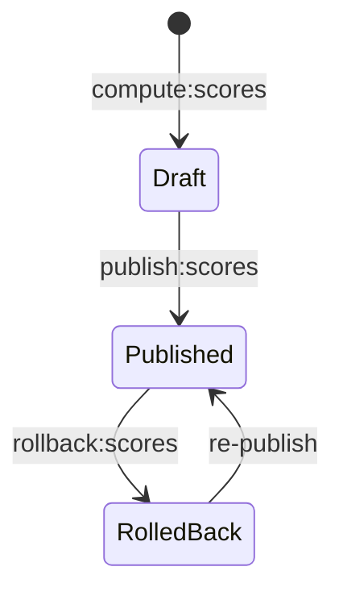

# Scoring

> How normalized indicator values are combined into composite 0–100 neighborhood scores.

## Overview

The `ScoringService` (`app/Services/ScoringService.php`) takes normalized indicator values and computes a weighted composite score for each DeSO area. The result is stored in `composite_scores` with version control for safe publishing.

## Running the Scoring Command

```bash
php artisan compute:scores --year=2024
```

This creates a new `ScoreVersion` with status `draft` and computes scores for all DeSOs.

## The Scoring Algorithm

### Step 1: Load Active Indicators

```php
$indicators = Indicator::where('is_active', true)
    ->where('weight', '>', 0)
    ->get();
```

### Step 2: For Each DeSO

For each of the 6,160 DeSO areas:

1. **Gather values**: Load `indicator_values` for this DeSO and year
2. **Check coverage**: Count how many indicators have non-NULL normalized values
3. **Invert negatives**: Apply direction handling:
   ```
   directed_value = (direction == 'negative') ? 1.0 - normalized_value : normalized_value
   ```
4. **Redistribute weights**: If some indicators are missing, scale available weights to sum to 1.0:
   ```
   adjusted_weight = indicator_weight / sum(available_weights)
   ```
5. **Compute score**: `score = Σ(directed_value × adjusted_weight) × 100`
6. **Identify factors**: Sort indicators by `|directed_value × weight|` to find top 3 positive and negative contributors

### Step 3: Store Results

Each DeSO gets a row in `composite_scores`:

```json
{
  "deso_code": "0114A0010",
  "year": 2024,
  "score": 72.4,
  "trend_1y": 2.1,
  "factor_scores": {
    "median_income": 14.2,
    "employment_rate": 3.8,
    "crime_total_rate": -5.1
  },
  "top_positive": ["median_income", "school_merit_value_avg", "employment_rate"],
  "top_negative": ["crime_total_rate", "debt_rate_pct", "perceived_safety"],
  "score_version_id": 42
}
```

## Version Control

Scores are version-controlled to prevent accidental changes to live data:

1. `compute:scores` creates a draft version
2. Admin reviews in the Data Quality dashboard
3. `publish:scores` makes the version live
4. `rollback:scores` reverts to a previous version



## Score Drift Detection

The `ScoreDriftDetector` service monitors for unusual changes between versions:

- Flags DeSOs with large score swings (e.g., >15 points)
- Detects systemic shifts in score distribution
- Results shown on the admin Data Quality dashboard

## Trends

After scoring, the `compute:trends` command computes year-over-year changes:

```bash
php artisan compute:trends
```

This uses the `TrendService` to calculate:
- Direction: `improving`, `declining`, `stable`, or `insufficient`
- Percent change and absolute change
- Confidence score based on data point count

Trends are only computed for DeSOs with `trend_eligible = true` (i.e., boundaries haven't changed).

## Known Issues & Edge Cases

- **Weight sum**: All active indicator weights should sum to 1.0. The scoring service handles deviation gracefully via redistribution, but results are more reliable when weights are balanced.
- **Minimum coverage**: DeSOs with fewer than 3 indicators worth of data still get scores, but they're less reliable. Consider flagging these.
- **Neutral indicators**: Indicators with `direction = neutral` are excluded from scoring (contribution = 0).
- **Trend eligibility**: ~176 DeSOs had boundary changes in the 2025 revision and cannot compute trends.

## Related

- [Scoring Engine](/architecture/scoring-engine)
- [Normalization](/data-pipeline/normalization)
- [Indicator Pattern](/architecture/indicator-pattern)
- [Data Quality](/data-pipeline/data-quality)
