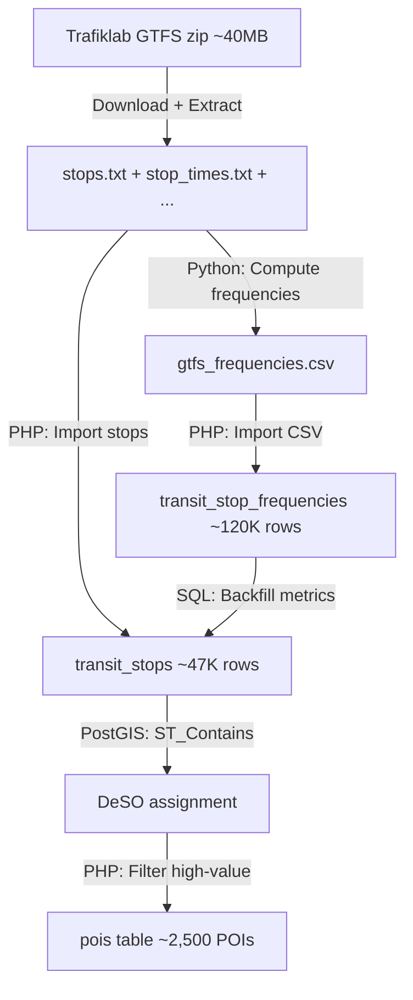

# GTFS Transit

> Public transport data from GTFS Sverige 2 — official timetable from Samtrafiken.

## Status: :green_circle: Implemented

GTFS transit data ingestion replaces OSM-sourced transit stops with authoritative timetable data from Sweden's national consolidated GTFS feed.

## Data Source

| Property | Value |
|---|---|
| Source | Trafiklab GTFS Sverige 2 (Samtrafiken) |
| Region | All Sweden — all modes |
| Feed size | ~40 MB zip |
| Modes | Rail, subway, tram, bus, ferry, on-demand |
| Auth | API key (register at trafiklab.se) |

Set `TRAFIKLAB_GTFS_KEY` in `.env`. Config in `config/services.php` under `trafiklab`.

## Command

```bash
php artisan ingest:gtfs
php artisan ingest:gtfs --target-date=20260310     # Specific date for frequency computation
php artisan ingest:gtfs --file=/path/to/sweden.zip  # Use local file
php artisan ingest:gtfs --skip-download              # Reuse extracted files
```

## Pipeline



### Step-by-step:

1. **Download** GTFS Sverige 2 zip (120s timeout) or use `--file` / `--skip-download`
2. **Extract** to `storage/app/data/raw/gtfs/` — validates essential files exist
3. **Clear** old OSM transit POIs and previous GTFS data (idempotent)
4. **Import stops** from `stops.txt` — filters by `location_type` (0=stop, 1=station), geographic bounds (Sweden only: 55–69°N, 11–25°E), batch inserts of 1,000
5. **Compute frequencies** via `scripts/compute_gtfs_frequencies.py`:
   - Streams `stop_times.txt` in 500K-row chunks
   - Filters active services for target date (calendar + exceptions)
   - Classifies departures into 4 time buckets: 06–09, 09–15, 15–18, 18–22
   - Counts departures per (stop, mode, bucket), tracks distinct routes
   - Outputs CSV with normalized columns
6. **Import frequency CSV** into `transit_stop_frequencies` table
7. **Backfill stop metrics** — SQL window function selects dominant mode per stop, computes `weekly_departures = daily × 5`
8. **Assign DeSO codes** via `ST_Contains(deso.geom, stop.geom)` spatial join
9. **Insert high-value stops as POIs** in tiered categories:

| Tier | POI Category | Criteria |
|---|---|---|
| 1 | `rail_station` | ≥20 departures/day, rail (1.5x mode weight) |
| 2 | `rail_station` | 1–19 departures/day, rail/subway |
| 3 | `tram_stop` | ≥1 departure/day, tram (1.2x mode weight) |
| 4 | `bus_stop_hf` | ≥56 departures/day, bus (~4/hour × 14h) |

## Tables

### `transit_stops`

~47,000 rows. Authoritative stop locations with aggregated frequency metrics.

### `transit_stop_frequencies`

~120,000 rows. Per-stop departure counts by mode category and time bucket. Multiple rows per stop (one per mode).

See [Database Schema](/architecture/database-schema) for full column definitions.

## Python Frequency Script

`scripts/compute_gtfs_frequencies.py` handles the computationally expensive part:

- **Mode classification**: Standard GTFS types (0–4) and extended Samtrafiken types (100–1500+)
- **Time buckets**: Morning rush (06–09), midday (09–15), afternoon rush (15–18), evening (18–22)
- **Target date selection**: If not specified, picks a Tuesday ~4 weeks from today (representative weekday)
- **Memory bounded**: 500K-row streaming chunks for `stop_times.txt`

## Indicators

| Indicator | Unit | Direction | Source | Layer |
|---|---|---|---|---|
| `transit_stop_density` | per 1,000 residents | positive | Area-level POI aggregation | Area (70%) |
| `prox_transit` | proximity score 0–100 | positive | ProximityScoreService | Proximity (30%) |

## Proximity Scoring

`ProximityScoreService::scoreTransit()` queries `transit_stops` (with fallback to `pois` table if empty):

```
decay = decayWithSafety(distance, maxDistance, safetyScore, 0.50)
modeWeight = {rail/subway: 1.5, tram: 1.2, bus: 1.0}
freqBonus = min(1.5, 0.5 + log₁₀(max(1, weekly_departures/7)) / 3)
stopScore = decay × modeWeight × freqBonus
```

**Urbanity-aware radii**: 800m (urban), 1,200m (semi-urban), 2,500m (rural).

Returns top 10 stops by distance, with details: nearest stop name, type, distance, effective distance (after safety modulation), weekly departures.

## Configuration

```php
// config/services.php
'trafiklab' => [
    'gtfs_key' => env('TRAFIKLAB_GTFS_KEY'),
],

// config/proximity.php
'scoring_radii' => [
    'transit' => ['urban' => 800, 'semi_urban' => 1200, 'rural' => 2500],
],
```

## Known Issues & Edge Cases

- **Python dependency**: Requires Python 3 with pandas in the Docker container (added to `docker/php/Dockerfile`)
- **Feed size**: `stop_times.txt` can be 300+ MB — Python streaming in 500K chunks keeps memory bounded
- **Overnight services**: GTFS allows `departure_time > 24:00:00` — script handles this correctly
- **Mode classification**: Samtrafiken uses extended route types (100–1500+) alongside standard GTFS (0–4)
- **Idempotent**: Each run clears and replaces all transit data — safe to re-run

## Related

- [Data Sources Overview](/data-sources/)
- [POI System](/indicators/poi)
- [Scoring Engine — Proximity](/architecture/scoring-engine#proximity-score-30)
- [Artisan Commands — ingest:gtfs](/operations/artisan-commands#ingest-gtfs)
