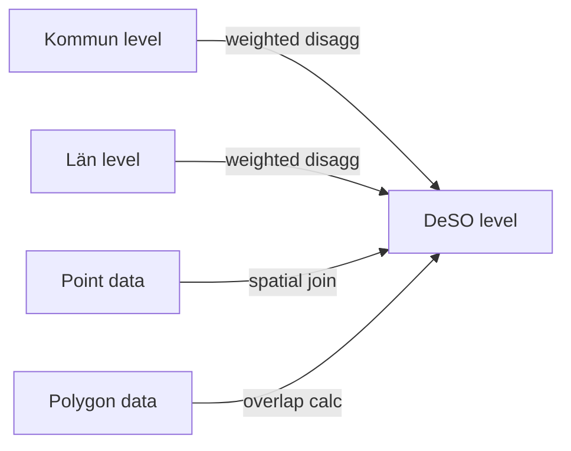

# Data Sources Overview

> Status matrix and summary of all external data sources feeding the PlatsIndex platform.

## Overview

PlatsIndex ingests data from 7 primary sources spanning government statistics, law enforcement data, education records, and open geographic data. All sources provide aggregate-level statistics — no individual-level personal data is stored or processed.

## Status Matrix

| Source | Status | Granularity | Update Freq | Indicators | API/File | Auth |
|---|---|---|---|---|---|---|
| SCB Demographics | :white_check_mark: Live | DeSO | Annual | 8 | API (PX-Web) | None |
| Skolverket Schools | :white_check_mark: Live | Point → DeSO | Daily/Annual | 3 | API (v2 + v3) | None |
| BRÅ Crime | :white_check_mark: Live | Kommun → DeSO | Annual | 3 | CSV/Excel | None |
| BRÅ NTU Survey | :white_check_mark: Live | Län → DeSO | Annual | 1 | Excel | None |
| Police Vulnerability | :white_check_mark: Live | Polygon → DeSO | ~2 years | 1 | GeoJSON | None |
| Kronofogden (Kolada) | :white_check_mark: Live | Kommun → DeSO | Annual | 3 | API (REST) | None |
| OSM POI | :white_check_mark: Live | Point → DeSO | Monthly | 8 | API (Overpass) | None |
| GTFS Transit | :white_check_mark: Live | Stop → DeSO | Monthly | 2 | GTFS file | API key |
| Google Places POI | :yellow_circle: Planned | Point → DeSO | Monthly | TBD | API (REST) | API key |

## Data Quality Summary

| Source | DeSO Coverage | Data Year | Known Limitations |
|---|---|---|---|
| SCB | 6,160 / 6,160 | 2024 | Employment only to 2021 (5,835 DeSOs) |
| Skolverket | ~2,500–3,800 | 2020/21 | Merit values limited; teacher cert better |
| BRÅ Crime | 6,160 (estimated) | 2024 | Disaggregated from 290 kommuner |
| NTU Survey | 6,160 (estimated) | 2025 | Disaggregated from 21 län |
| Police | ~275 DeSOs penalized | 2025 | Applied as score penalty (-8/-15 pts), not indicator |
| Kronofogden | 6,160 (estimated) | 2024 | R²=0.40 disaggregation quality |
| GTFS Transit | ~47,000 stops | 2026 | Replaces OSM transit data; requires Python for frequency computation |
| OSM POI | Variable | 2026 | Urban bias in OSM coverage |

## Disaggregation Required

Several sources don't provide data at DeSO level and require spatial disaggregation:

| Source | Native Granularity | Disaggregation Method |
|---|---|---|
| BRÅ Crime | 290 kommuner | Demographic-weighted propensity |
| NTU Survey | 21 län | Inverted demographic weighting |
| Kronofogden | 290 kommuner | Demographic-weighted propensity |
| Police Areas | 65 named polygons | PostGIS spatial overlap |
| Skolverket | School points | Point-in-polygon assignment |
| OSM POI | Points | Point-in-polygon + catchment |

## Legal & Ethical Constraints

All data sources comply with GDPR and Swedish privacy law:

- **Aggregate only**: No individual-level data is stored
- **GDPR Article 10**: No searchable database linking individuals to criminal convictions
- **Supreme Court 2025**: The ruling against bulk court judgment databases does not affect this platform (which uses aggregate statistics only)
- **`foreign_background_pct`**: Exists in database but has weight 0.00 — excluded from scoring per legal/ethical review

See [Legal Constraints](/methodology/legal-constraints) for full details.

## Related

- [SCB Demographics](/data-sources/scb-demographics)
- [Skolverket Schools](/data-sources/skolverket-schools)
- [BRÅ Crime](/data-sources/bra-crime)
- [Kronofogden Debt](/data-sources/kronofogden-debt)
- [POI (OpenStreetMap)](/data-sources/poi-openstreetmap)
- [Ingestion Pipeline](/data-pipeline/ingestion)
