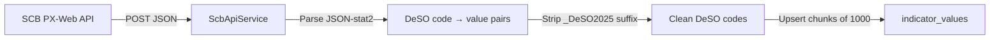

# SCB Demographics

> Statistics Sweden (SCB) PX-Web API — the primary source for DeSO-level demographic data.

## Overview

SCB provides the core demographic indicators at native DeSO granularity via a free, open API. This is the cleanest data path in the pipeline — no disaggregation needed.

## API Details

| Property | Value |
|---|---|
| Base URL | `https://api.scb.se/OV0104/v1/doris/sv/ssd/` |
| Protocol | PX-Web (POST with JSON body, JSON-stat2 response) |
| Auth | None required |
| Rate limits | No published hard limits; use reasonable frequency |
| Interactive explorer | https://www.statistikdatabasen.scb.se |
| DeSO lookup tool | https://regina.scb.se |

## Request Format

```php
// app/Services/ScbApiService.php
$response = Http::post($baseUrl . $tablePath, [
    'query' => [
        ['code' => 'Region', 'selection' => ['filter' => 'all', 'values' => ['*']]],
        ['code' => 'ContentsCode', 'selection' => ['filter' => 'item', 'values' => [$fieldCode]]],
        ['code' => 'Tid', 'selection' => ['filter' => 'item', 'values' => [(string)$year]]],
    ],
    'response' => ['format' => 'json-stat2'],
]);
```

## Indicators Fetched

| Indicator | SCB Table | Field Code | Category |
|---|---|---|---|
| `median_income` | HE0110 | HE0110K3 | income |
| `low_economic_standard_pct` | HE0110 | — | income |
| `employment_rate` | AM0207 | — | employment |
| `education_post_secondary_pct` | UF0506 | — | education |
| `education_below_secondary_pct` | UF0506 | — | education |
| `foreign_background_pct` | BE0101 | — | demographics |
| `population` | BE0101 | — | demographics |
| `rental_tenure_pct` | BO0104 | — | housing |

## DeSO Code Handling

### DeSO 2025 Suffix

SCB API responses for DeSO 2025 data append `_DeSO2025` to codes:

```
Raw from API: "0114A0010_DeSO2025"
After strip:  "0114A0010"
```

The `extractDesoCode()` helper strips this suffix.

### Prefer DeSO 2025

When a table contains both old DeSO codes and DeSO 2025 codes, the ingestion command prefers DeSO 2025 versions. This gives 6,160 matched areas instead of 5,984.

**Exception**: The employment table (AM0207) only goes to 2021 with old DeSO codes, yielding 5,835 matches.

## Response Parsing

JSON-stat2 responses have a specific structure:

```json
{
  "class": "dataset",
  "dimension": {
    "Region": { "category": { "index": { "0114A0010_DeSO2025": 0 } } },
    "ContentsCode": { "category": { "index": { "HE0110K3": 0 } } },
    "Tid": { "category": { "index": { "2024": 0 } } }
  },
  "value": [312000, 285000, ...]
}
```

The `ScbApiService` parses this to produce `[deso_code => value]` pairs.

## Configuration

All SCB indicator definitions are in `database/seeders/IndicatorSeeder.php`. Each indicator specifies:
- `source_table`: The SCB table path
- `source_field_code`: The ContentsCode value

## Known Issues & Edge Cases

- **Memory requirement**: Large API responses (all 6,160 DeSOs × multiple years) require `memory_limit=1G`
- **Suppressed data**: SCB suppresses values for DeSOs with very small populations (statistical confidentiality)
- **Employment lag**: AM0207 table hasn't been updated past 2021 at DeSO level
- **API stability**: SCB API is generally reliable but has occasional maintenance windows
- **Bulk operations**: Use `DB::table()->upsert()` with chunks of 1,000 — individual `updateOrCreate` causes memory exhaustion at 6,160+ rows

## Data Flow



## Related

- [Data Sources Overview](/data-sources/)
- [Income Indicators](/indicators/income)
- [Employment Indicators](/indicators/employment)
- [Education Indicators](/indicators/education)
- [Ingestion Pipeline](/data-pipeline/ingestion)
