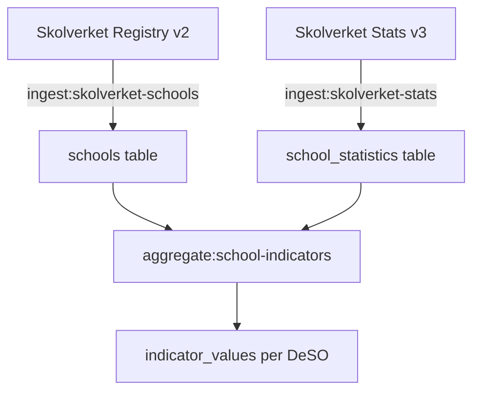

# Skolverket Schools

> School locations and academic performance from Skolverket's two APIs.

## Overview

Skolverket provides school data through two separate APIs:
1. **Skolenhetsregistret v2** — School registry (locations, metadata)
2. **Planned Educations v3** — Academic statistics (merit values, achievement rates)

## API Details

### Skolenhetsregistret v2 (School Registry)

| Property | Value |
|---|---|
| Purpose | School unit locations, types, operators |
| Update frequency | Daily |
| Cost | Free |
| Auth | None |

### Planned Educations v3 (Statistics)

| Property | Value |
|---|---|
| Purpose | Academic performance per school |
| Accept header | `application/vnd.skolverket.plannededucations.api.v3.hal+json` |
| Max page size | ~100 (returns 404 on size=500) |
| Cost | Free |
| Auth | None |

## Data Collected

### From Registry (schools table)

| Field | Description |
|---|---|
| `school_unit_code` | Unique identifier |
| `name` | School name |
| `type_of_schooling` | Grundskola, gymnasieskola, etc. |
| `operator_type` | Kommun, enskild (private) |
| `school_forms` | Array of school form codes |
| `lat` / `lng` | Coordinates |
| `status` | active / inactive |

### From Statistics (school_statistics table)

| Field | Description |
|---|---|
| `merit_value_17` | Average meritvärde (best 17 subjects, max 340) |
| `goal_achievement_pct` | % students achieving goals |
| `teacher_certification_pct` | % certified teachers (behöriga lärare) |
| `student_count` | Number of students |
| `academic_year` | E.g., "2020/21" |

## Ingestion Commands

```bash
# Fetch school registry
php artisan ingest:skolverket-schools

# Fetch academic statistics
php artisan ingest:skolverket-stats

# Aggregate to DeSO-level indicators
php artisan aggregate:school-indicators --academic-year=2020/21 --calendar-year=2024
```

## Known Issues & Edge Cases

- **Page size limit**: The v3 API returns 404 on `size=500`. Use ~100.
- **Swedish decimals**: Statistics use comma as decimal separator. Convert with `str_replace(',', '.', $value)`.
- **Value validation**: Only use values where `valueType === 'EXISTS'`. Skip `.` and `..` placeholder values.
- **HTTP pool errors**: `Http::pool()` returns `ConnectionException` for failed requests — always check `instanceof Response` before calling `->successful()`.
- **Data vintage**: Most school statistics are from 2020/21. Skolverket restricted publication after that academic year.
- **Coverage gap**: Teacher certification data has much better coverage (~3,800 DeSOs) than merit/achievement data (~2,500 DeSOs).
- **Coordinate quality**: ~15% of schools have NULL coordinates in the registry API. The `geocode:schools` command can attempt to fill gaps.
- **DeSO assignment**: Schools are assigned to DeSOs via PostGIS point-in-polygon (`assign:poi-deso` or spatial join during ingestion).

## Data Flow



## Related

- [Data Sources Overview](/data-sources/)
- [School Quality Indicators](/indicators/school-quality)
- [Merit Value Methodology](/methodology/meritvalue)
